---
## Front matter
lang: ru-RU
title: Лабораторная работа №8
subtitle: "Оптимизация"
author:
  - Дурдалыев Максат
teacher:
  - Кулябов Д. С.
  - д.ф.-м.н., профессор
  - профессор кафедры теории вероятностей и кибербезопасности 
institute:
  - Российский университет дружбы народов имени Патриса Лумумбы, Москва, Россия
date: today
date-format: "YYYY-MM-DD" # Example: 2025-09-06

## i18n babel
babel-lang: russian
babel-otherlangs: english
---

## Докладчик

:::::::::::::: {.columns align=center}
::: {.column width="70%"}

  * Дурдалыев Максат
  * Cтудент НКНбд-01-22
  * Российский университет дружбы народов имени Патриса Лумумбы
  * [1132205337@pfur.ru](mailto:1132205337@pfur.ru)
  * <https://github.com/mdurdalyyev>

:::
::: {.column width="30%"}

:::
::::::::::::::

## Цели и задачи

**Цель работы**

Основная цель работа — освоить пакеты Julia для решения задач оптимизации.

**Задание**

1. Используя Jupyter Lab, повторите примеры.

2. Выполните задания для самостоятельной работы.

## Выполнение лабораторной работы

{#fig:001 width=80%}

## Выполнение лабораторной работы

{#fig:002 width=80%}

## Выполнение лабораторной работы

{#fig:003 width=70%}

## Выполнение лабораторной работы

{#fig:004 width=70%}

## Выполнение лабораторной работы

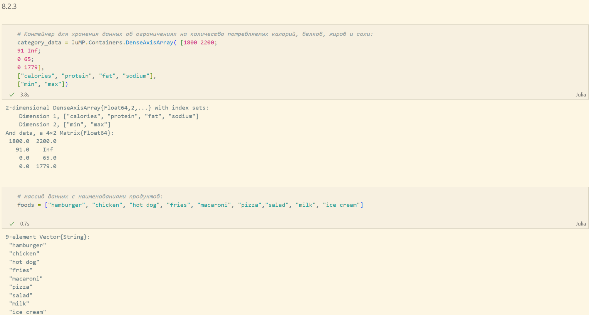{#fig:005 width=70%}

## Выполнение лабораторной работы

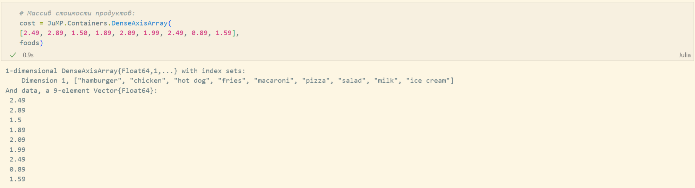{#fig:006 width=90%}

## Выполнение лабораторной работы

{#fig:007 width=70%}

## Выполнение лабораторной работы

{#fig:008 width=70%}

## Выполнение лабораторной работы

{#fig:009 width=70%}

## Выполнение лабораторной работы

{#fig:010 width=90%}

## Выполнение лабораторной работы

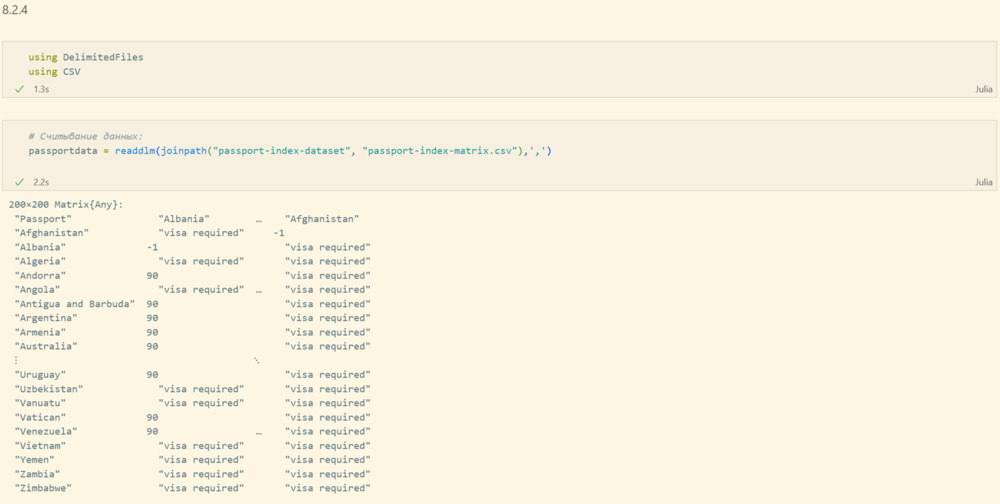{#fig:011 width=70%}

## Выполнение лабораторной работы

{#fig:012 width=70%}

## Выполнение лабораторной работы

{#fig:013 width=90%}

## Выполнение лабораторной работы

{#fig:014 width=70%}

## Выполнение лабораторной работы

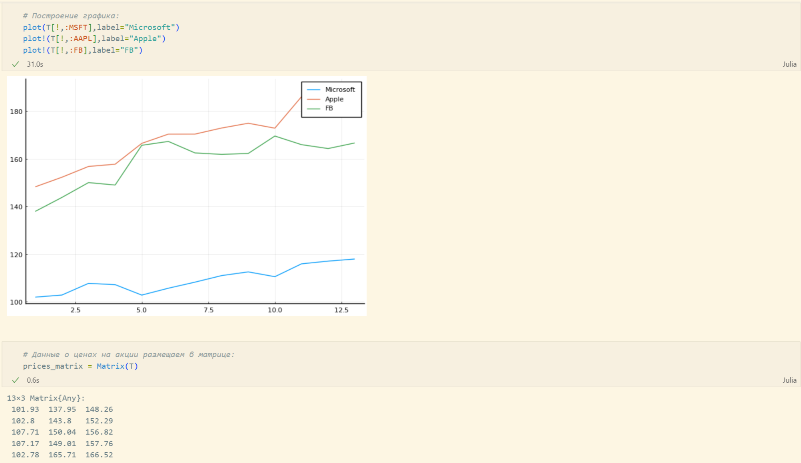{#fig:015 width=70%}

## Выполнение лабораторной работы

{#fig:016 width=70%}

## Выполнение лабораторной работы

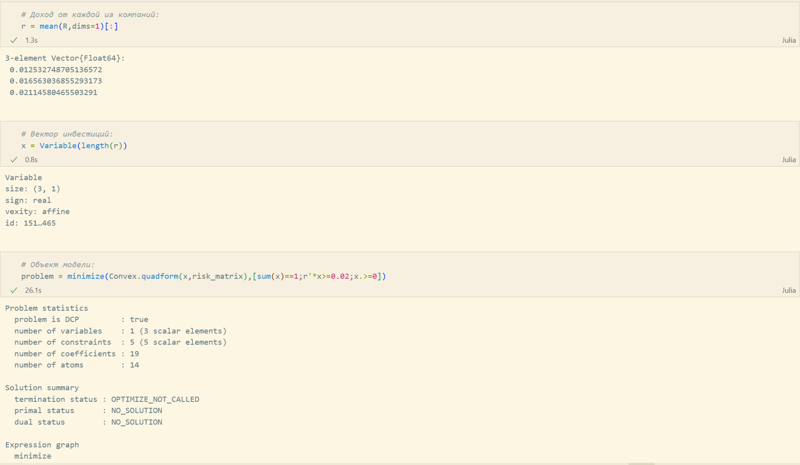{#fig:017 width=70%}

## Выполнение лабораторной работы

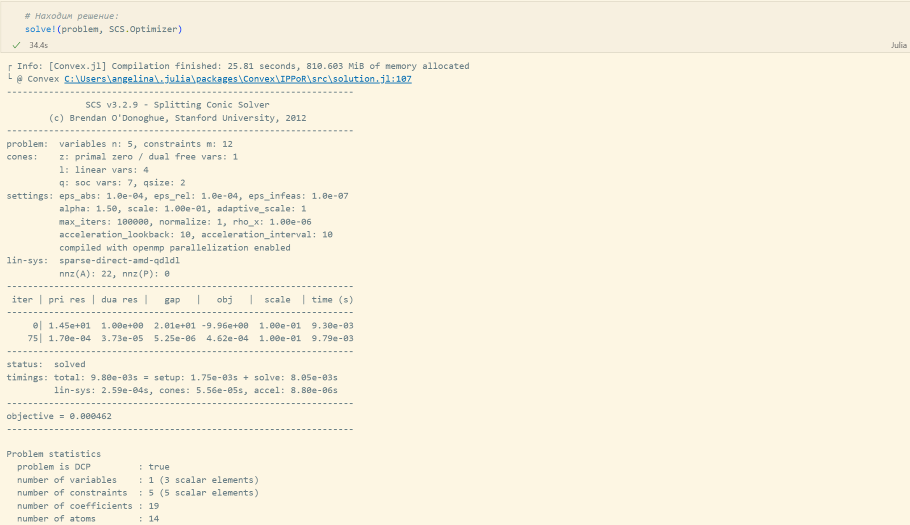{#fig:018 width=70%}

## Выполнение лабораторной работы

{#fig:019 width=70%}

## Выполнение лабораторной работы

{#fig:020 width=90%}

## Выполнение лабораторной работы

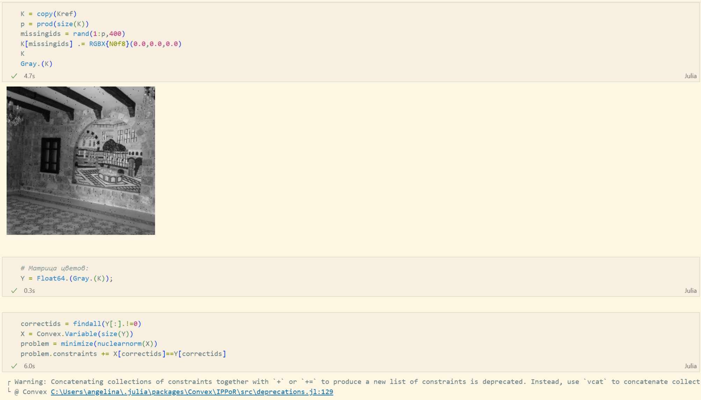{#fig:021 width=70%}

## Выполнение лабораторной работы

{#fig:022 width=70%}

## Выполнение лабораторной работы

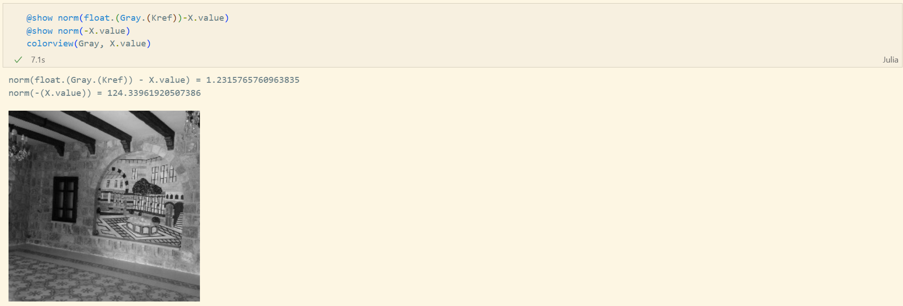{#fig:023 width=70%}

## Выполнение лабораторной работы

{#fig:024 width=70%}

## Выполнение лабораторной работы

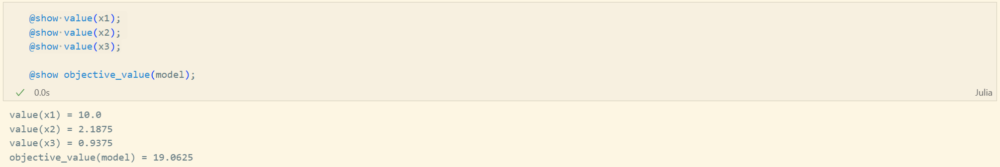{#fig:025 width=70%}

## Выполнение лабораторной работы

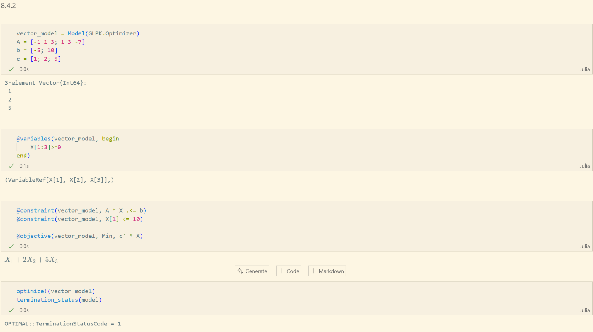{#fig:026 width=70%}

## Выполнение лабораторной работы

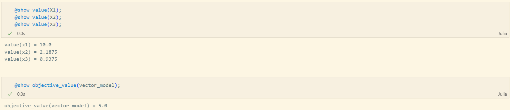{#fig:027 width=70%}

## Выполнение лабораторной работы

{#fig:028 width=70%}

## Выполнение лабораторной работы

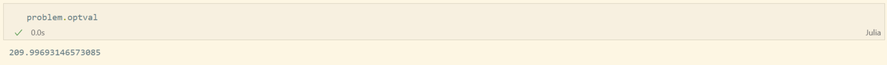{#fig:029 width=70%}

## Выполнение лабораторной работы

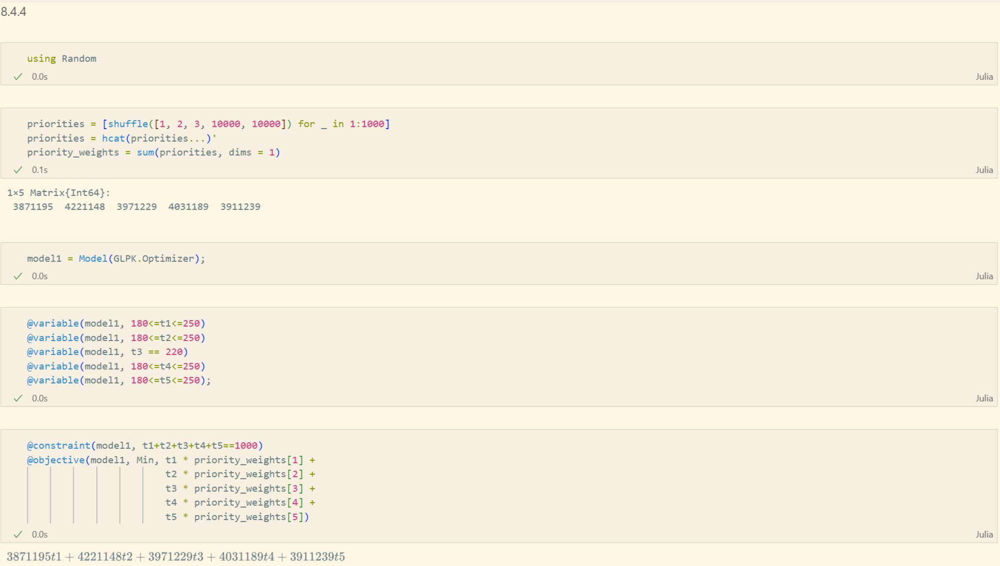{#fig:030 width=70%}

## Выполнение лабораторной работы

{#fig:031 width=70%}

## Выполнение лабораторной работы

{#fig:032 width=70%}

## Вывод

В ходе выполнения лабораторной работы я освоил пакеты Julia для решения задач оптимизации