---
## Front matter
title: "Лабораторная работа №8"
subtitle: "Оптимизация"
author: "Дурдалыев Максат"
---

# Введение

## Цели и задачи

**Цель работы**

Основная цель работа — освоить пакеты Julia для решения задач оптимизации[@julialang].

**Задание**

1. Используя Jupyter Lab, повторите примеры.

2. Выполните задания для самостоятельной работы[@juliadoc].

# Выполнение лабораторной работы

Выполним примеры из лабораторной работы (рис. [-@fig:001]-[-@fig:023]).

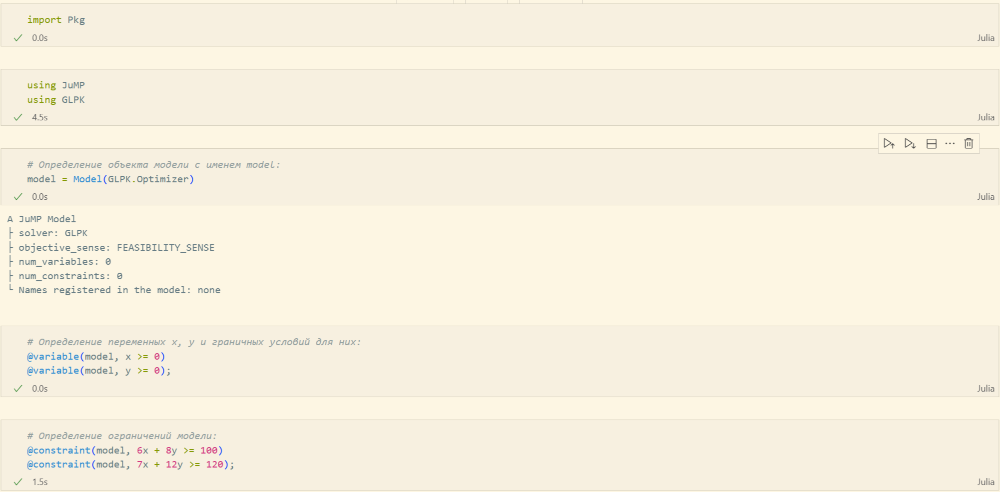{#fig:001 width=70%}

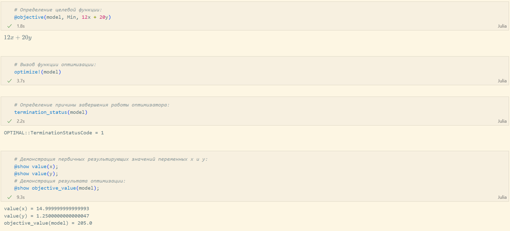{#fig:002 width=70%}

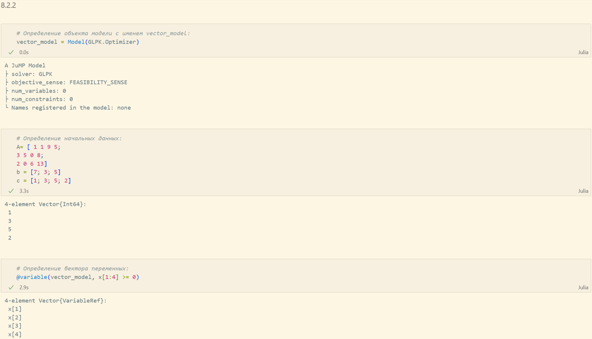{#fig:003 width=70%}

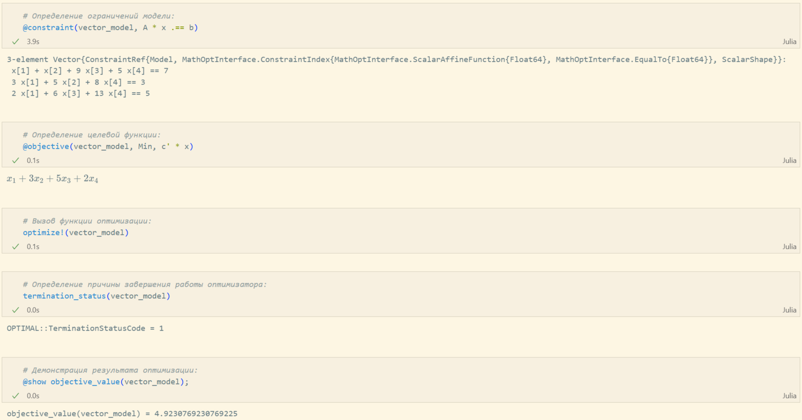{#fig:004 width=70%}

{#fig:005 width=70%}

{#fig:006 width=70%}

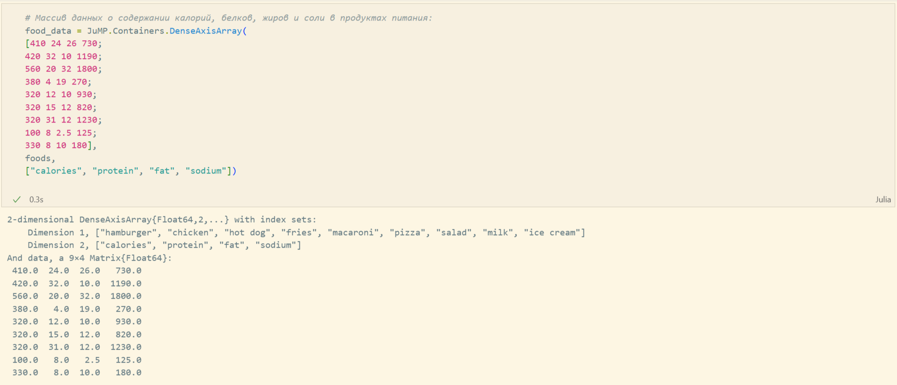{#fig:007 width=70%}

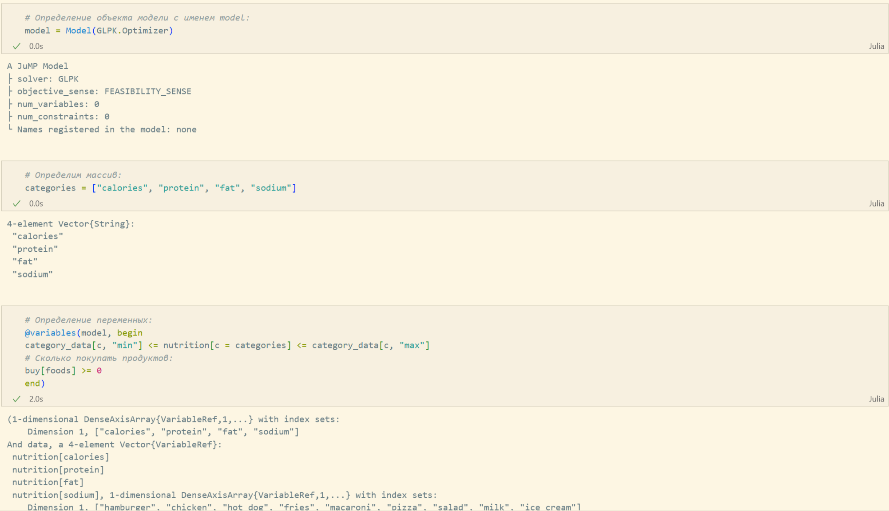{#fig:008 width=70%}

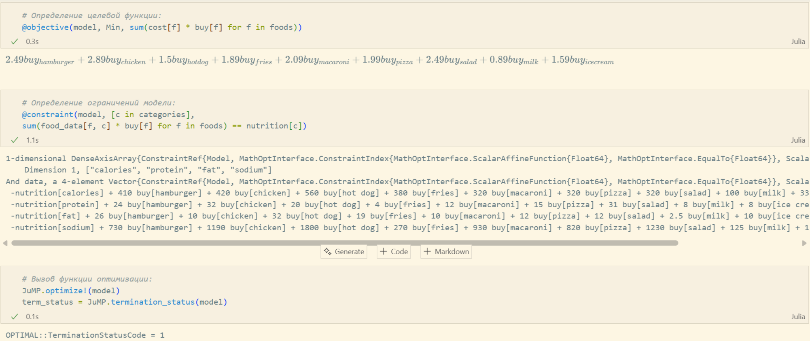{#fig:009 width=70%}

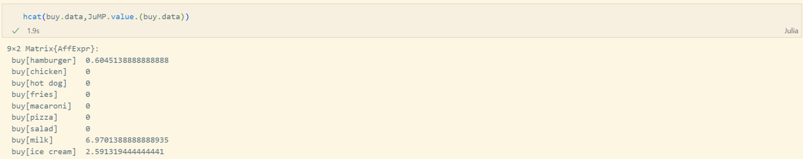{#fig:010 width=70%}

{#fig:011 width=70%}

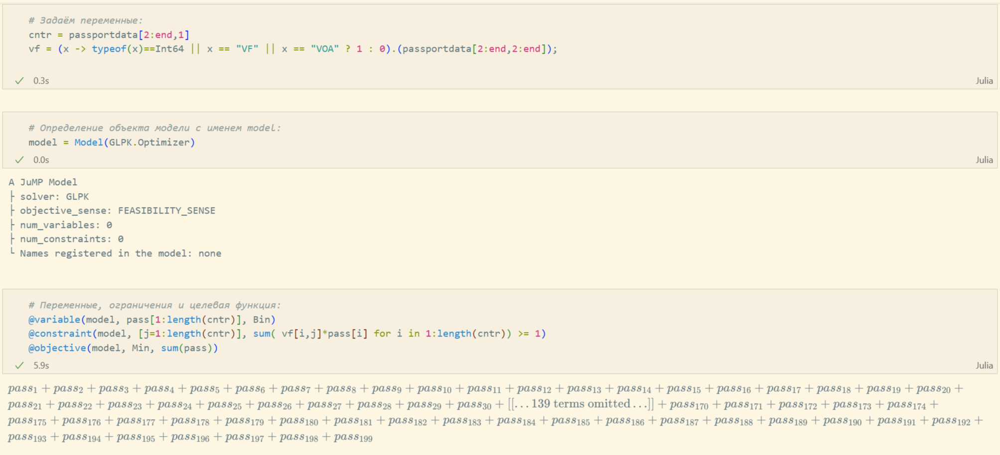{#fig:012 width=70%}

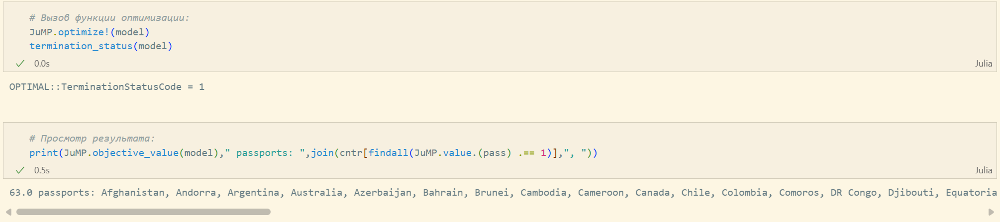{#fig:013 width=70%}

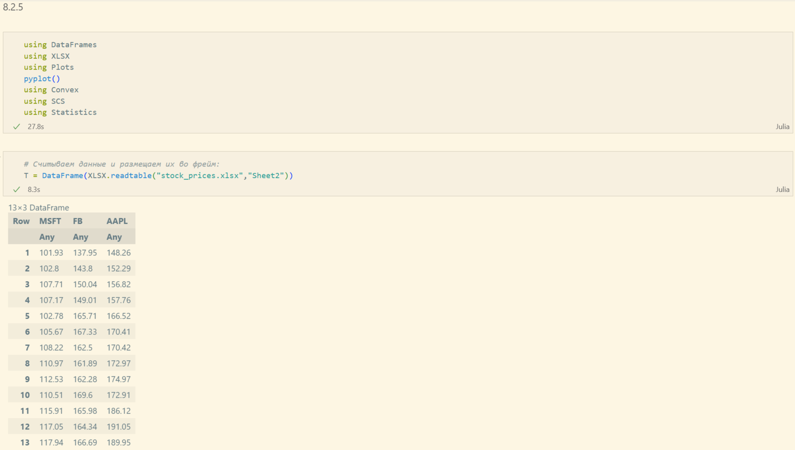{#fig:014 width=70%}

{#fig:015 width=70%}

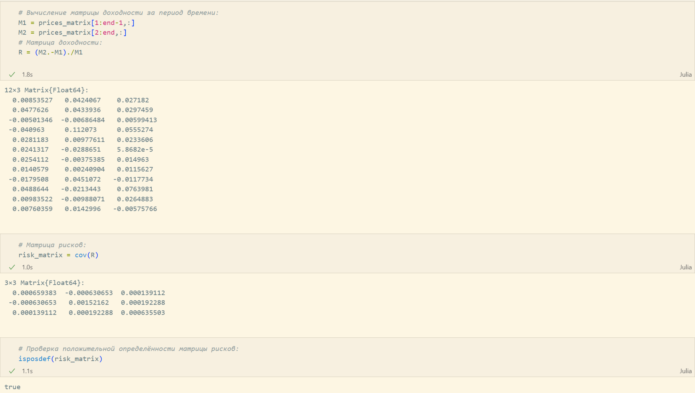{#fig:016 width=70%}

{#fig:017 width=70%}

{#fig:018 width=70%}

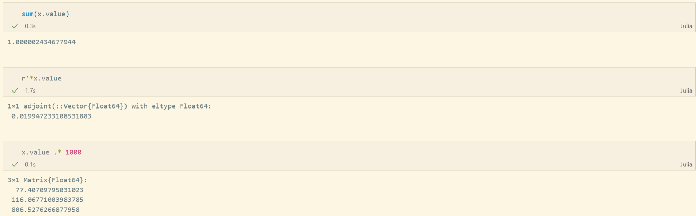{#fig:019 width=70%}

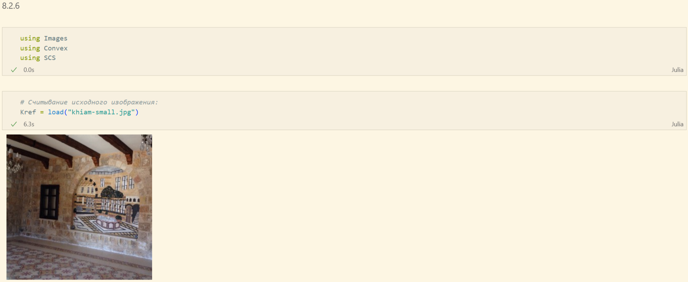{#fig:020 width=70%}

{#fig:021 width=70%}

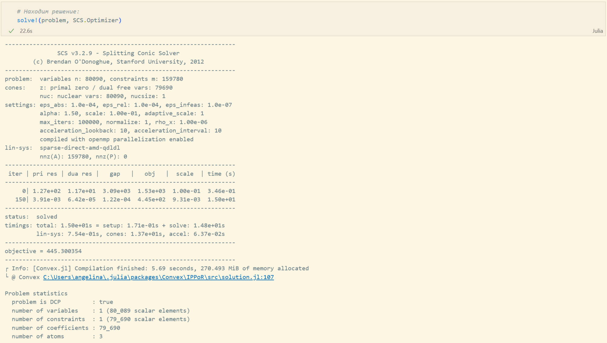{#fig:022 width=70%}

{#fig:023 width=70%}

Теперь выполним задания для самостоятельный работы (рис. [-@fig:024]-[-@fig:032]).

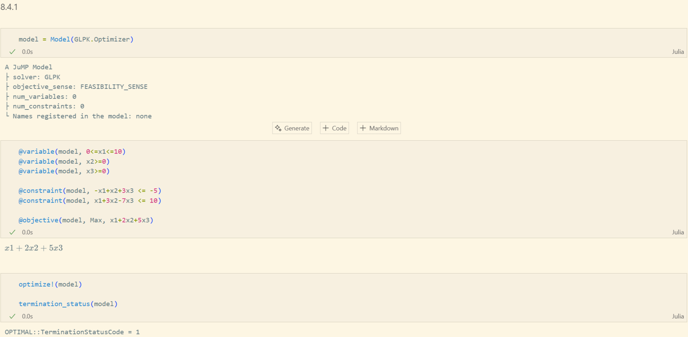{#fig:024 width=70%}

{#fig:025 width=70%}

{#fig:026 width=70%}

{#fig:027 width=70%}

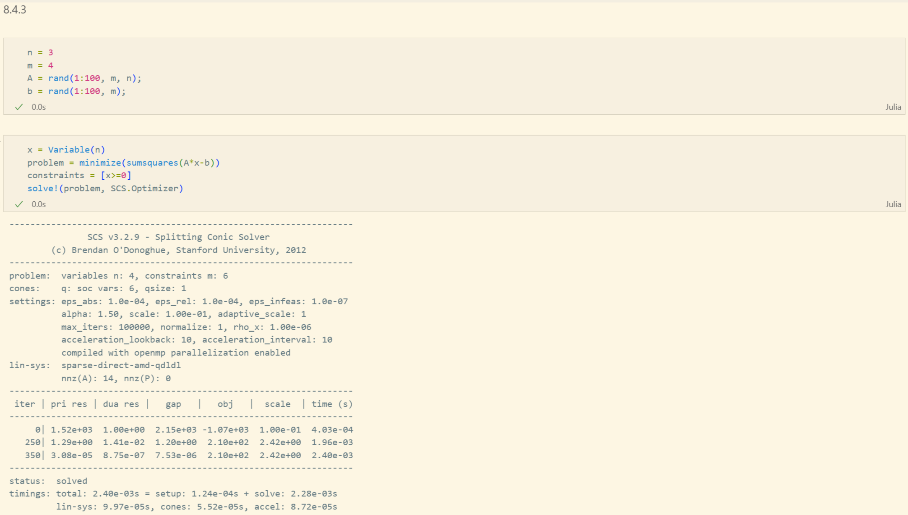{#fig:028 width=70%}

{#fig:029 width=70%}

{#fig:030 width=70%}

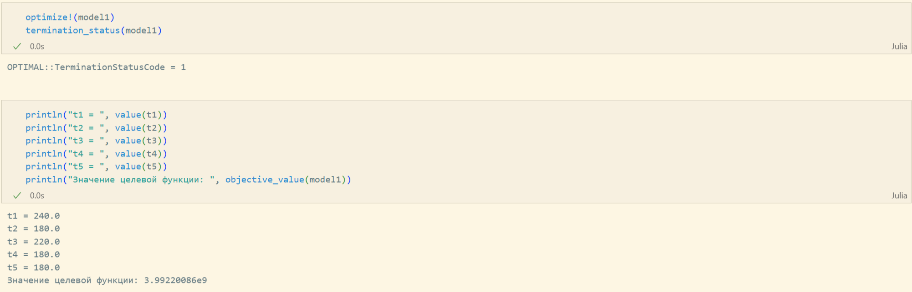{#fig:031 width=70%}

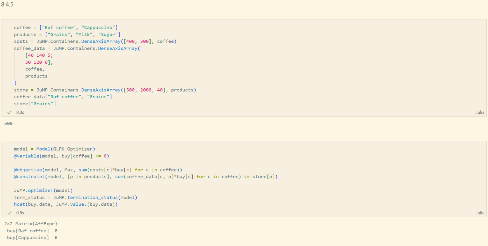{#fig:032 width=70%}

# Вывод

В ходе выполнения лабораторной работы я освоил пакеты Julia для решения задач оптимизации.

# Список литературы{.unnumbered}

::: {#refs}
:::