---
## Front matter
title: "Лабораторная работа №5"
subtitle: "Построение графиков"
author: "Дурдалыев Максат"
---

# Введение

## Цели и задачи

**Цель работы**

Основная цель работы — освоить синтаксис языка Julia для построения графиков[@julialang].

**Задание**

1. Используя Jupyter Lab, повторите примеры. При этом дополните графики обозначениями осей координат, легендой с названиями траекторий, названиями графиков и т.п.

2. Выполните задания для самостоятельной работы[@juliadoc].

# Выполнение лабораторной работы

## Основные пакеты для работы с графиками в Julia

Julia поддерживает несколько пакетов для работы с графиками. Использование того или иного пакета зависит от целей, преследуемых пользователем при построении. Стандартным для Julia является пакет Plots.jl.

Рассмотрим построение графика функции f(x) = (3x2 + 6x − 9)e−0,3x разными способами (рис. [-@fig:001] - рис. [-@fig:005]):

{ #fig:001 width=100% height=100% }

{ #fig:002 width=100% height=100% }

{ #fig:003 width=100% height=100% }

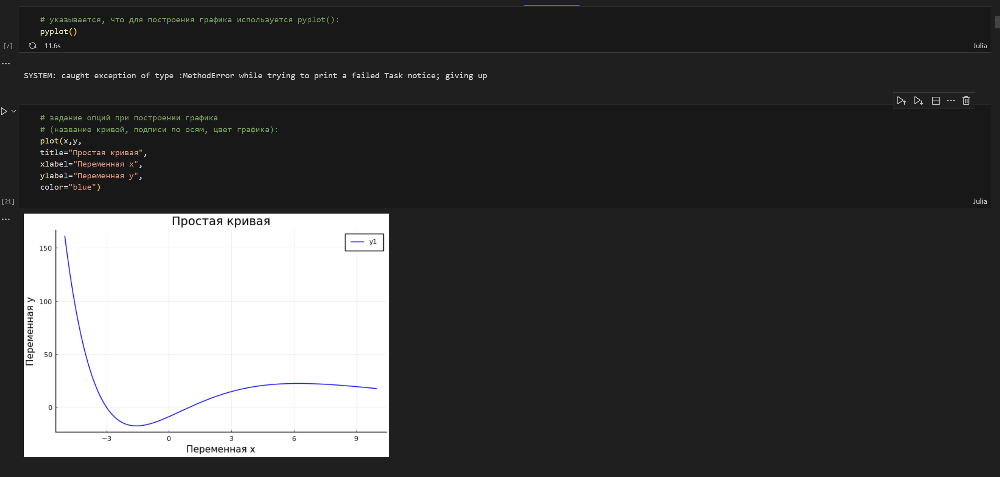{ #fig:004 width=100% height=100% }

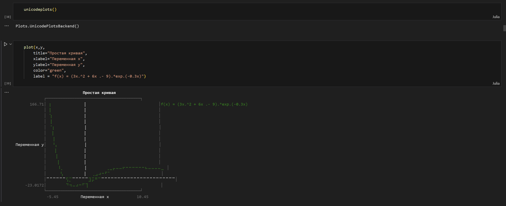{ #fig:005 width=100% height=100% }

## Опции при построении графика

На примере графика функции sin(x) и графика разложения этой функции в ряд Тейлора рассмотрим дополнительные возможности пакетов для работы с графикой (рис. [-@fig:006] - рис. [-@fig:008]):

{ #fig:006 width=100% height=100% }

{ #fig:007 width=100% height=100% }

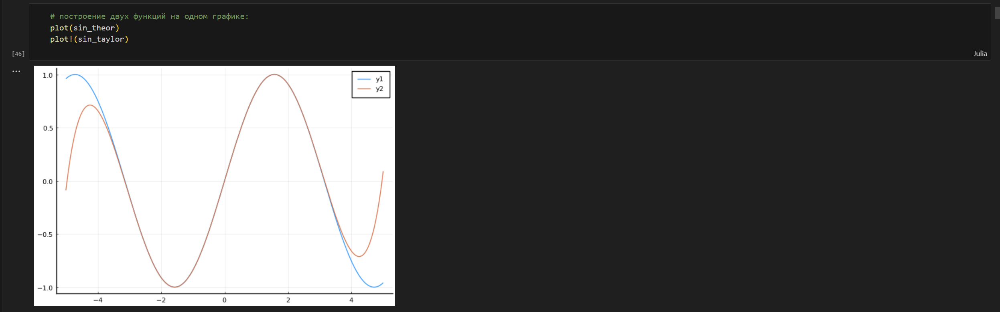{ #fig:008 width=100% height=100% }

Затем добавим различные опции для отображения на графике (рис. [-@fig:009] - рис. [-@fig:010]):

{ #fig:009 width=100% height=100% }

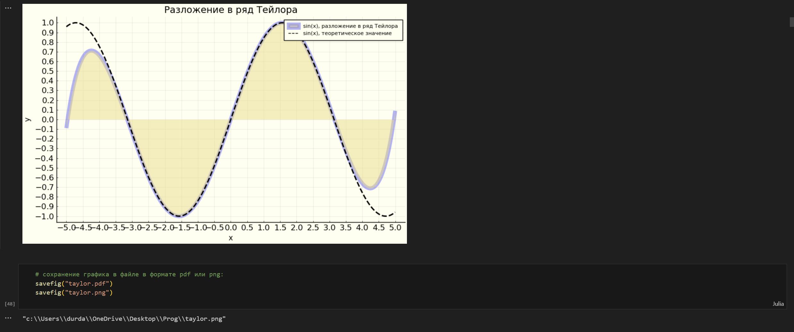{ #fig:010 width=100% height=100% }

## Точечный график

Как и при построении обычного графика для точечного графика необходимо задать массив значений х, посчитать или задать значения у, задать опции построения графика (рис. [-@fig:011]):

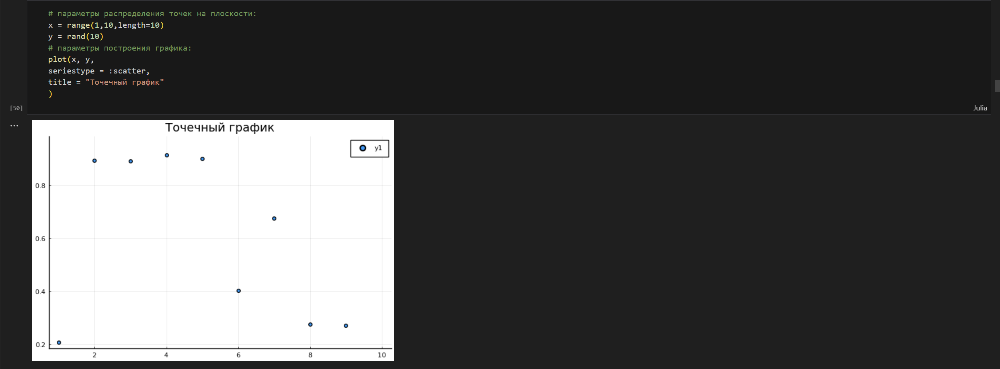{ #fig:011 width=100% height=100% }

Для точечного графика можно задать различные опции, например размер маркера, его тип, цвет и и т.п. (рис. [-@fig:012]):

{ #fig:012 width=100% height=100% }

Также можно строить и 3-мерные точечные графики (рис. [-@fig:013]):

{ #fig:013 width=100% height=100% }

## Аппроксимация данных

Аппроксимация — научный метод, состоящий в замене объектов их более простыми аналогами, сходными по своим свойствам.

Для демонстрации зададим искусственно некоторую функцию, в данном случае похожую по поведению на экспоненту (рис. [-@fig:014]):

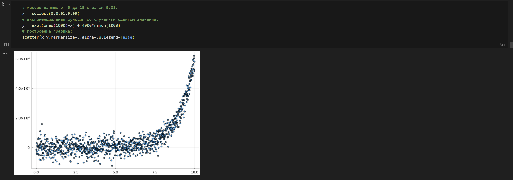{ #fig:014 width=100% height=100% }

Аппроксимируем полученную функцию полиномом 5-й степени (рис. [-@fig:015]):

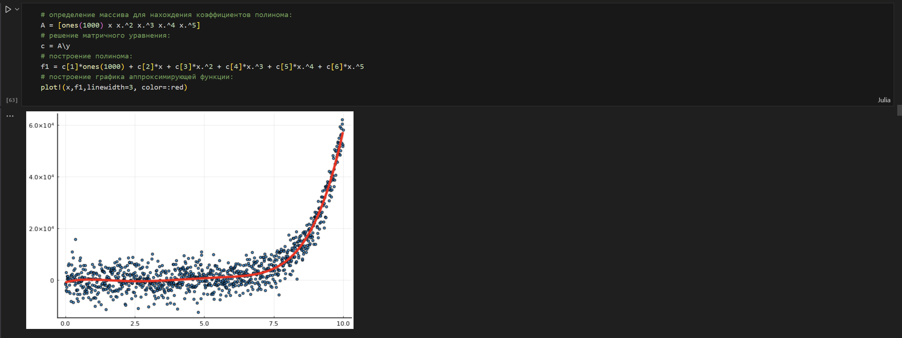{ #fig:015 width=100% height=100% }

## Две оси ординат

Иногда требуется на один график вывести несколько траекторий с существенными отличиями в значениях по оси ординат.

Пример траектории (рис. [-@fig:016]):

{ #fig:016 width=100% height=100% }

## Полярные координаты

Приведём пример построения графика функции в полярных координатах (рис. [-@fig:017]):

{ #fig:017 width=100% height=100% }

## Параметрический график

Приведём пример построения графика параметрически заданной кривой на плоскости (рис. [-@fig:018]):

{ #fig:018 width=100% height=100% }

Далее приведём пример построения графика параметрически заданной кривой в пространстве (рис. [-@fig:019]):

{ #fig:019 width=100% height=100% }

## График поверхности

Для построения поверхности, заданной уравнением f(x, y) = x2 + y2, можно воспользоваться функцией surface() (рис. [-@fig:020]):

{ #fig:020 width=100% height=100% }

Также можно воспользоваться функцией plot() с заданными параметрами (рис. [-@fig:021]):

{ #fig:021 width=100% height=100% }

Можно задать параметры сглаживания (рис. [-@fig:022]):

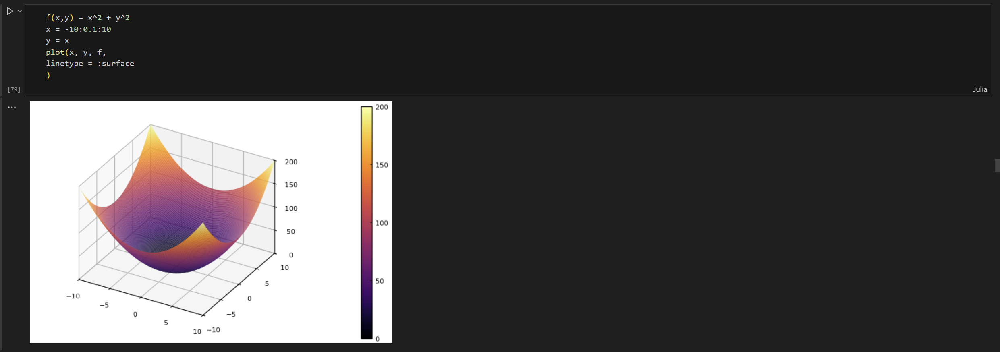{ #fig:022 width=100% height=100% }

Можно задать определённый угол зрения (рис. [-@fig:023]):

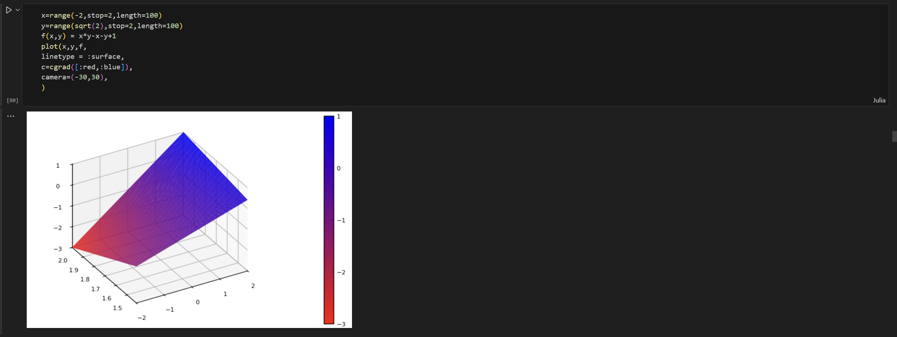{ #fig:023 width=100% height=100% }

## Линии уровня

Линией уровня некоторой функции от двух переменных называется множество точек на координатной плоскости, в которых функция принимает одинаковые значения. Линий уровня бесконечно много, и 
через каждую точку области определения можно провести линию уровня.

С помощью линий уровня можно определить наибольшее и наименьшее значение исходной функции от 
двух переменных. Каждая из этих линий соответствует определённому значению высоты. 

Поверхности уровня представляют собой непересекающиеся пространственные поверхности.

Рассмотрим поверхность, заданную функцией g(x, y) = (3x + y2)| sin(x) + cos(y)| (рис. [-@fig:024]):

{ #fig:024 width=100% height=100% }

Линии уровня можно построить, используя проекцию значений исходной функции на плоскость (рис. [-@fig:025]):

{ #fig:025 width=100% height=100% }

Можно дополнительно добавить заливку цветом (рис. [-@fig:026]):

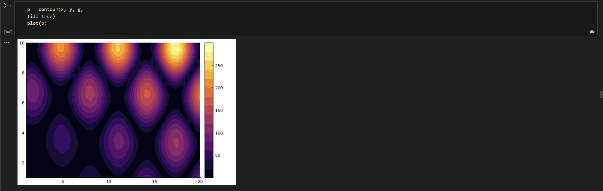{ #fig:026 width=100% height=100% }

## Векторные поля

Если каждой точке некоторой области пространства поставлен в соответствие вектор с началом в 
данной точке, то говорят, что в этой области задано векторное поле.

Векторные поля задают векторными функциями.

Для функции h(x, y) = x3 − 3x + y2 сначала построим её график (рис. [-@fig:027]) и линии уровня (рис. [-@fig:028]):

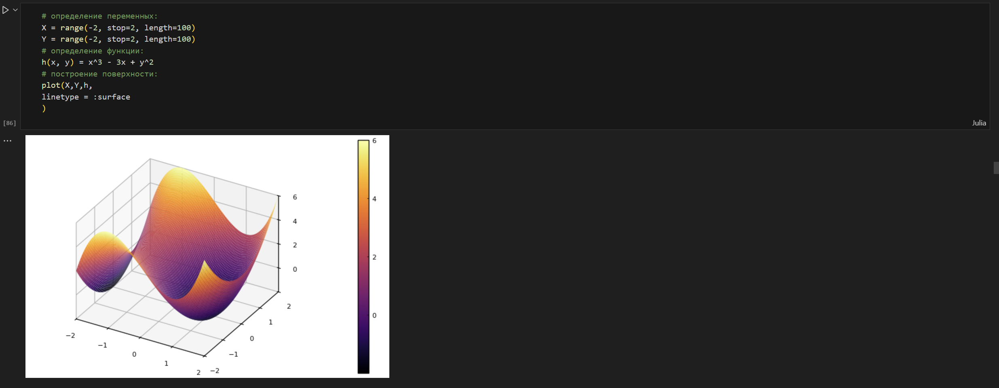{ #fig:027 width=100% height=100% }

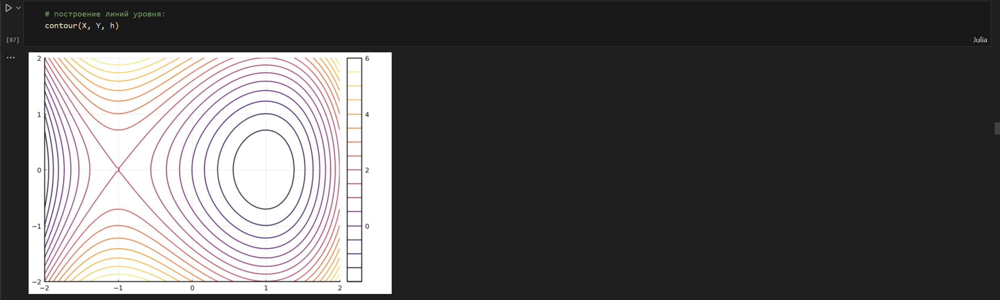{ #fig:028 width=100% height=100% }

## Анимация

Технически анимированное изображение представляет собой несколько наложенных изображений (или построенных в разных точках графиках) в одном файле.

В Julia рекомендуется использовать gif-анимацию в pyplot().

Строим поверхность (рис. [-@fig:029]):

{ #fig:029 width=100% height=100% }

Добавляем анимацию (рис. [-@fig:030]):

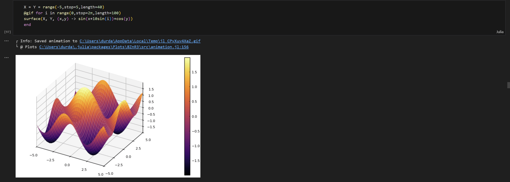{ #fig:030 width=100% height=100% }

## Гипоциклоида

Гипоциклоида — плоская кривая, образуемая точкой окружности, катящейся по внутренней стороне другой окружности без скольжения.

Построим большую окружность (рис. [-@fig:031] - рис. [-@fig:032]):

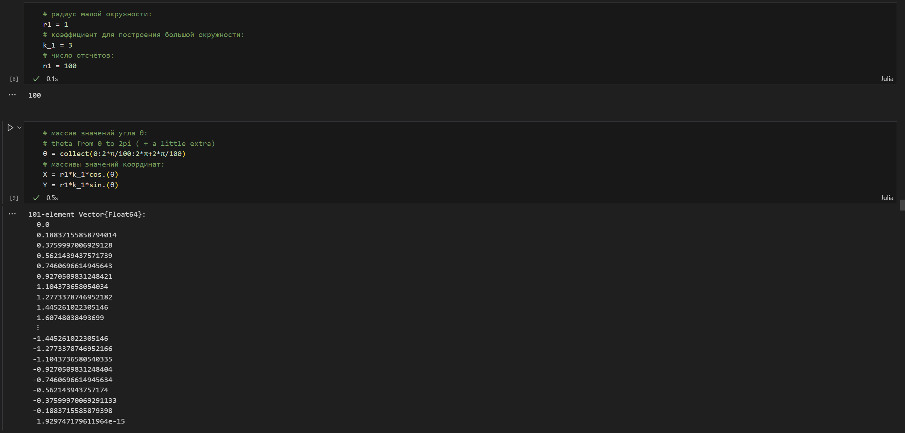{ #fig:031 width=100% height=100% }

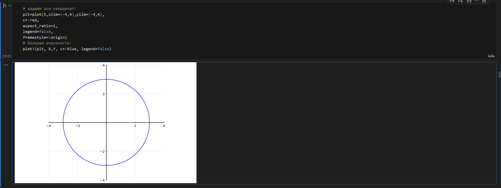{ #fig:032 width=100% height=100% }

Для частичного построения гипоциклоиды будем менять параметр t (рис. [-@fig:033]):

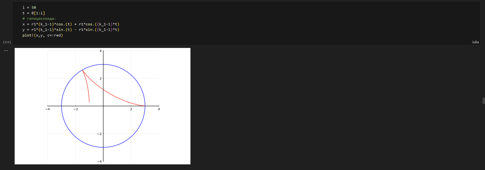{ #fig:033 width=100% height=100% }

Добавляем малую окружность гипоциклоиды (рис. [-@fig:034]):

{ #fig:034 width=100% height=100% }

Добавим радиус для малой окружности (рис. [-@fig:035]):

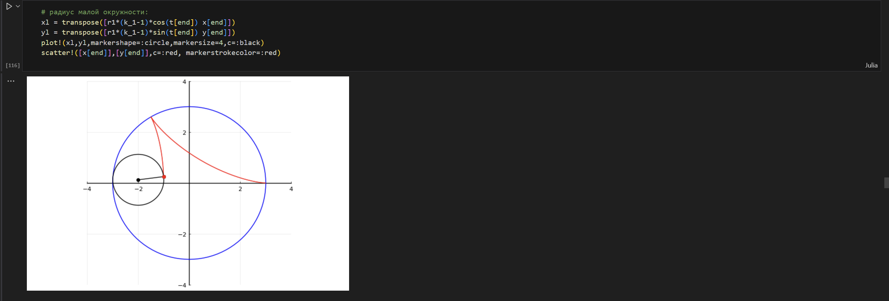{ #fig:035 width=100% height=100% }

## Errorbars

В исследованиях часто требуется изобразить графики погрешностей измерения.

Построим график исходных значений (рис. [-@fig:036] - рис. [-@fig:037]):

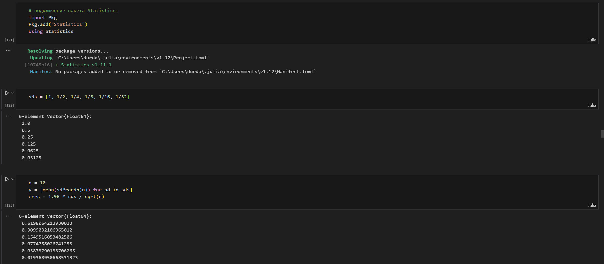{ #fig:036 width=100% height=100% }

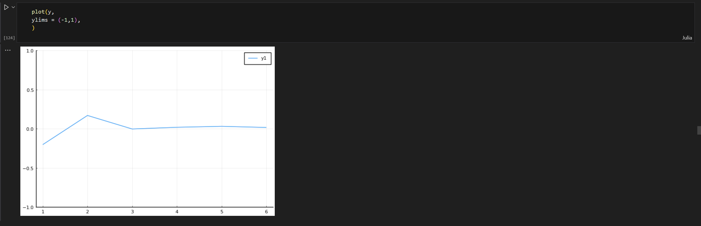{ #fig:037 width=100% height=100% }

Построим график отклонений от исходных значений (рис. [-@fig:038]):

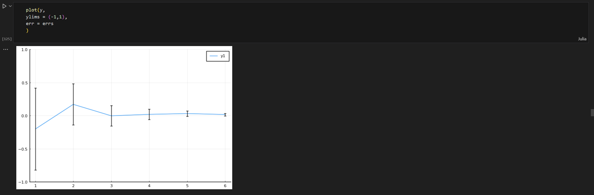{ #fig:038 width=100% height=100% }

Повернём график (рис. [-@fig:039]):

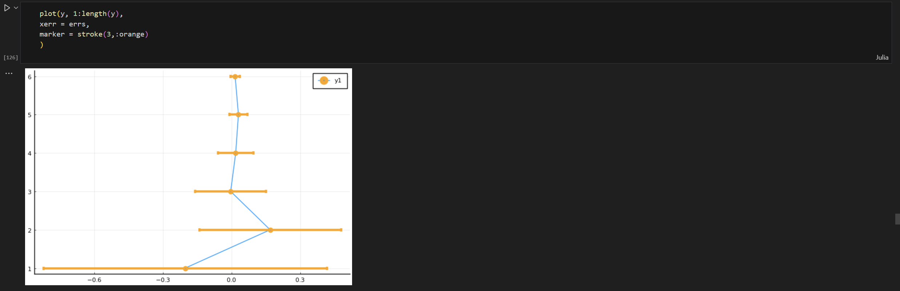{ #fig:039 width=100% height=100% }

Заполним область цветом (рис. [-@fig:040]):

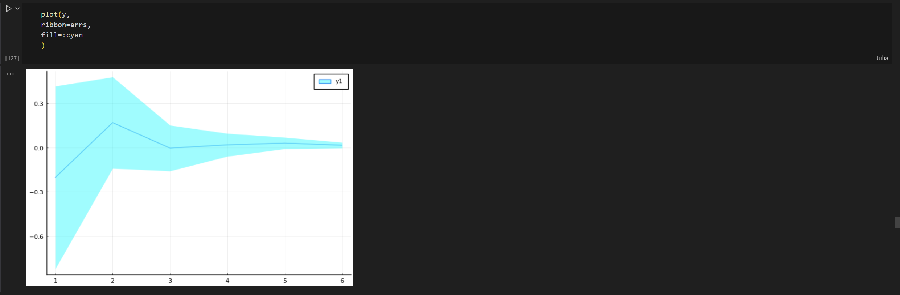{ #fig:040 width=100% height=100% }

Можно построить график ошибок по двум осям (рис. [-@fig:041]):

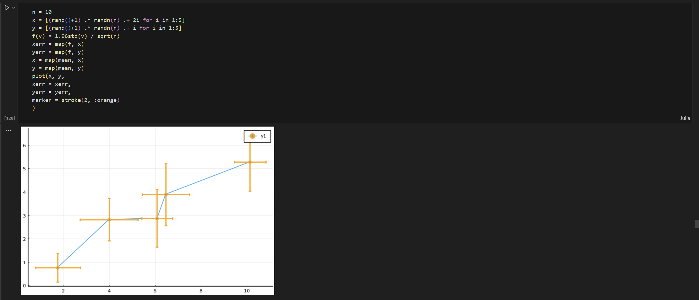{ #fig:041 width=100% height=100% }

Можно построить график асимметричных ошибок по двум осям (рис. [-@fig:042]):

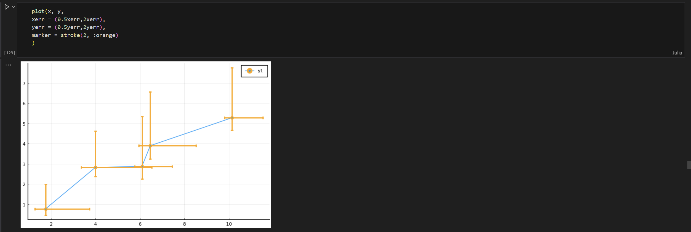{ #fig:042 width=100% height=100% }

## Использование пакета Distributions

Строим гистограмму (рис. [-@fig:043]):

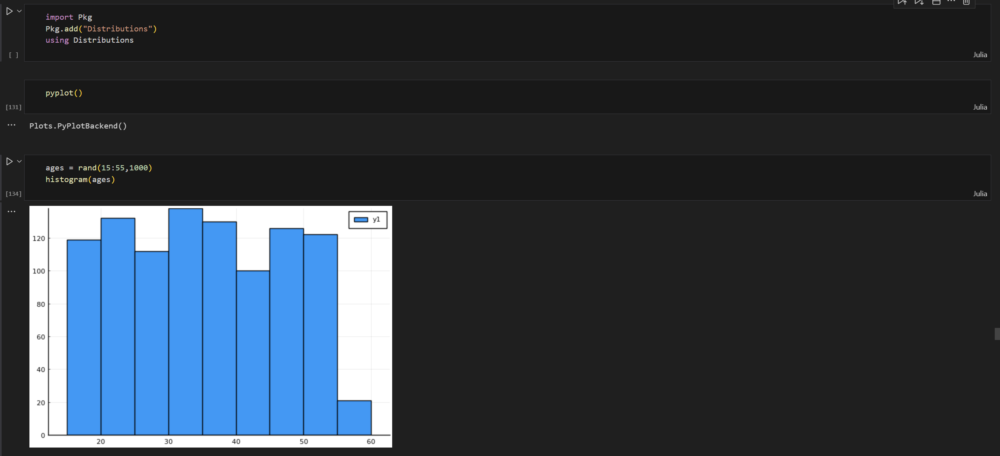{ #fig:043 width=100% height=100% }

Задаём нормальное распределение и строим гистограмму (рис. [-@fig:044]):

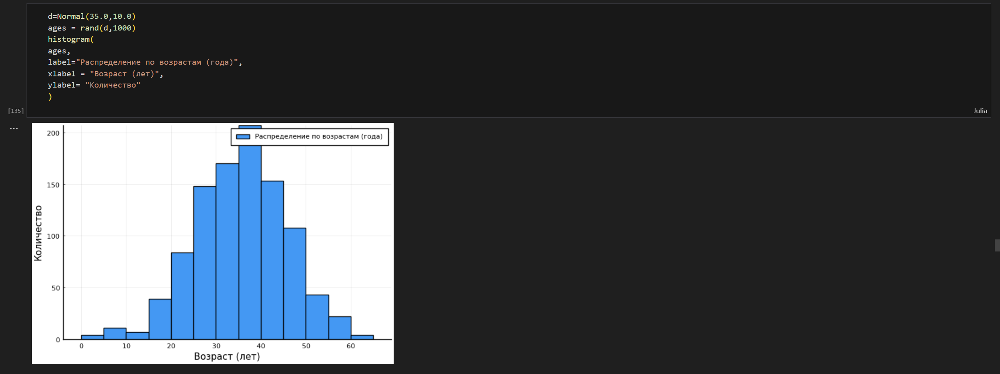{ #fig:044 width=100% height=100% }

## Подграфики

Определим макет расположения графиков. Команда layout принимает кортеж layout = (N, M), который строит сетку графиков NxM. Например, если задать layout = (4,1) на графике четыре серии, то получим четыре ряда графиков (рис. [-@fig:041]):

{ #fig:045 width=100% height=100% }

Для автоматического вычисления сетки необходимо передать layout целое число (рис. [-@fig:046]):

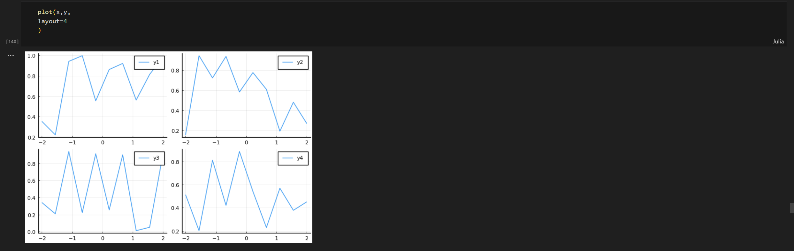{ #fig:046 width=100% height=100% }

Аргумент heights принимает в качестве входных данных массив с долями желаемых высот. Если в сумме дроби не составляют 1,0, то некоторые подзаголовки могут отображаться неправильно (рис. [-@fig:047]).

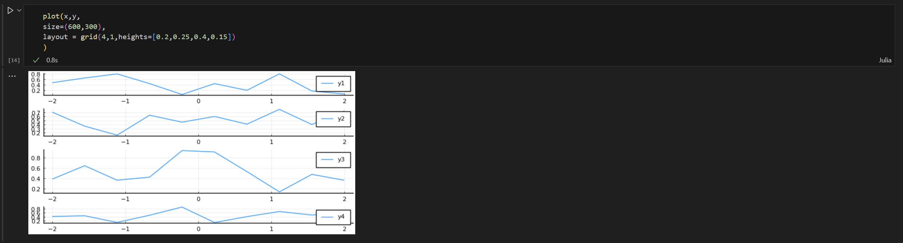{ #fig:047 width=100% height=100% }

Можно сгенерировать отдельные графики и объединить их в один, например, в сетке 2 × 2 (рис. [-@fig:048] - рис. [-@fig:049]):

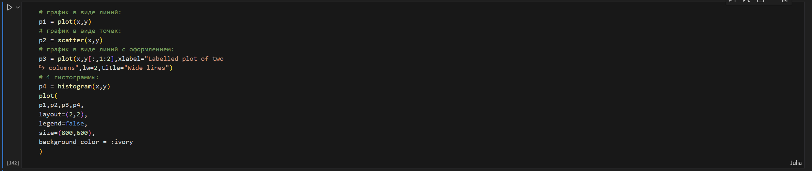{ #fig:048 width=100% height=100% }

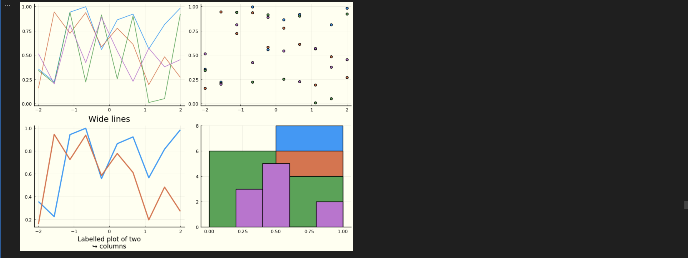{ #fig:049 width=100% height=100% }

Обратите внимание, что атрибуты на отдельных графиках применяются к отдельным графикам, в то время как атрибуты в последнем вызове plot применяются ко всем графикам.

Разнообразные варианты представления данных (рис. [-@fig:050]):

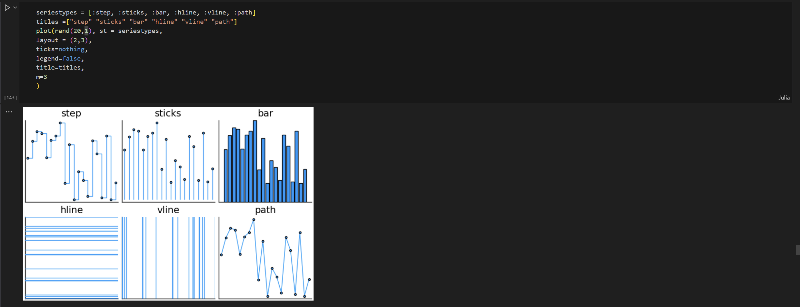{ #fig:050 width=100% height=100% }

Применение макроса наиболее простой способ определения сложных макетов. Точные размеры могут быть заданы с помощью фигурных скобок, в противном случае пространство будет поровну разделено между графиками (рис. [-@fig:051]):

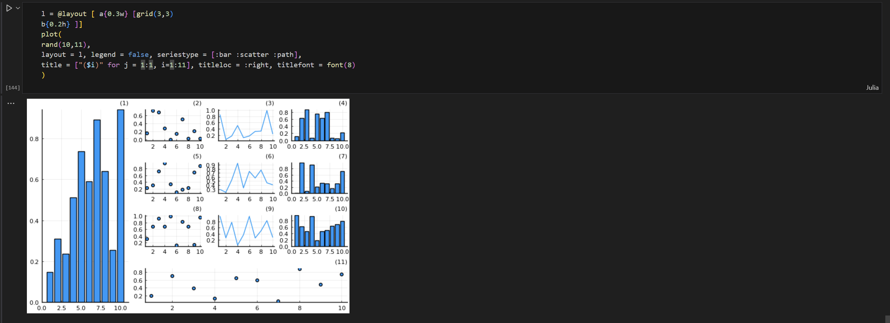{ #fig:051 width=100% height=100% }

## Самостоятельное выполнение

Выполнение задания №1 (рис. [-@fig:052]):

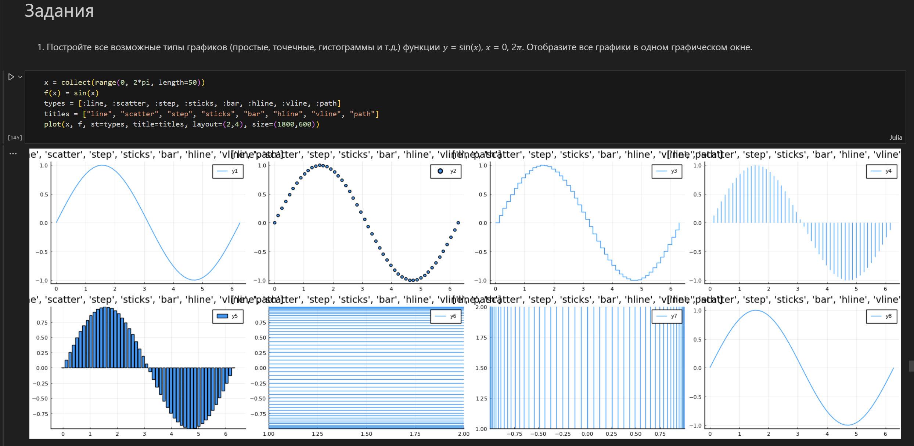{ #fig:052 width=100% height=100% }

Выполнение задания №2 (рис. [-@fig:053]):

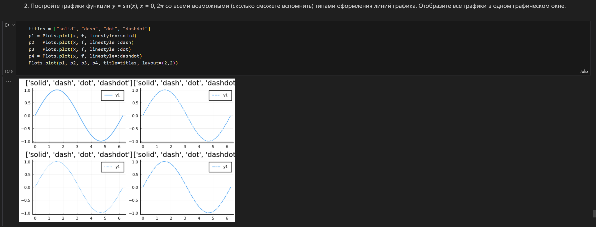{ #fig:053 width=100% height=100% }

Выполнение задания №3 (рис. [-@fig:054]):

{ #fig:054 width=100% height=100% }

Выполнение задания №4 (рис. [-@fig:055]):

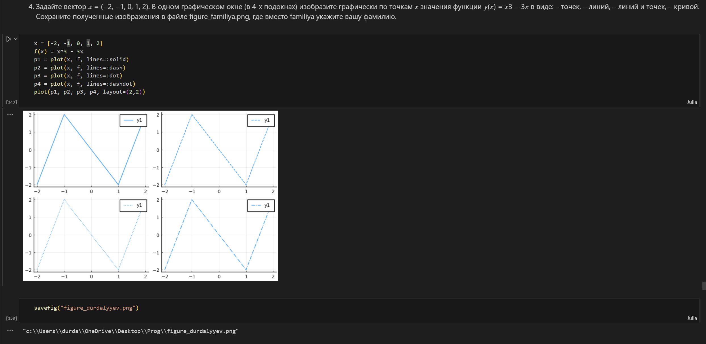{ #fig:055 width=100% height=100% }

Выполнение задания №5 (рис. [-@fig:056] - рис. [-@fig:057]):

{ #fig:056 width=100% height=100% }

{ #fig:057 width=100% height=100% }

Выполнение задания №6 (рис. [-@fig:058]):

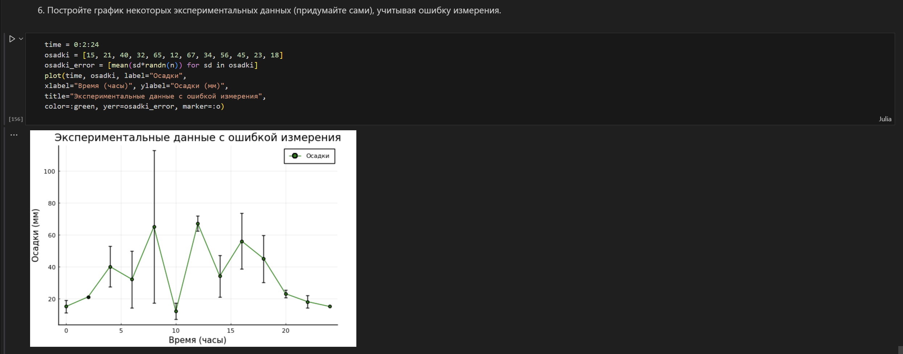{ #fig:058 width=100% height=100% }

Выполнение задания №7 (рис. [-@fig:059]):

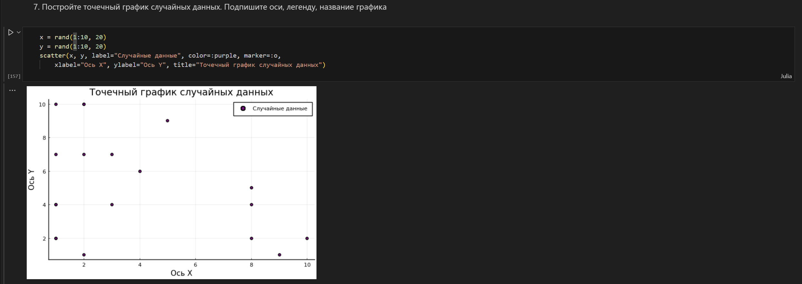{ #fig:059 width=100% height=100% }

Выполнение задания №8 (рис. [-@fig:060]):

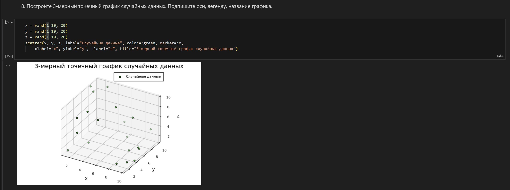{ #fig:060 width=100% height=100% }

Выполнение задания №9 (рис. [-@fig:061]):

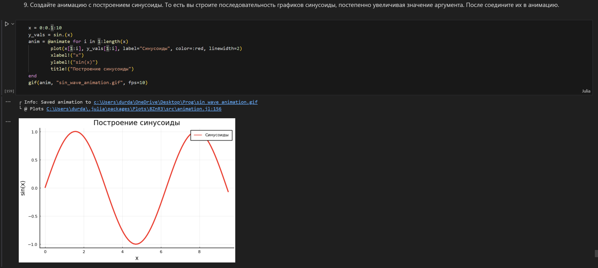{ #fig:061 width=100% height=100% }

Выполнение задания №10 (рис. [-@fig:062] - рис. [-@fig:067]):

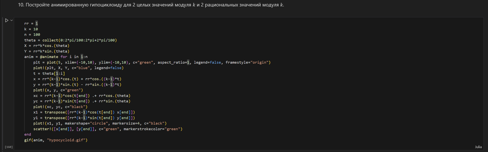{ #fig:062 width=100% height=100% }

{ #fig:063 width=100% height=100% }

{ #fig:064 width=100% height=100% }

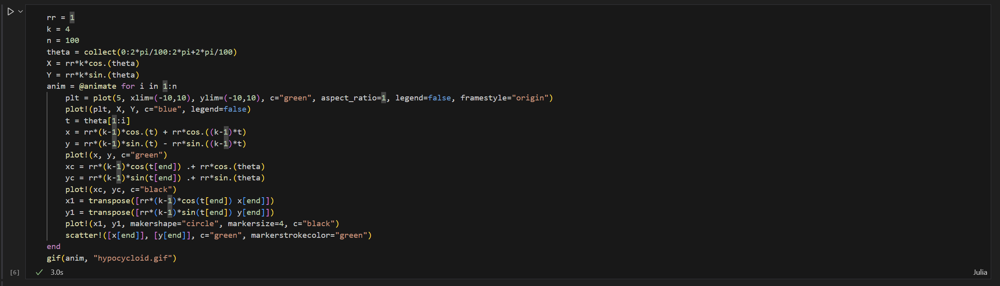{ #fig:065 width=100% height=100% }

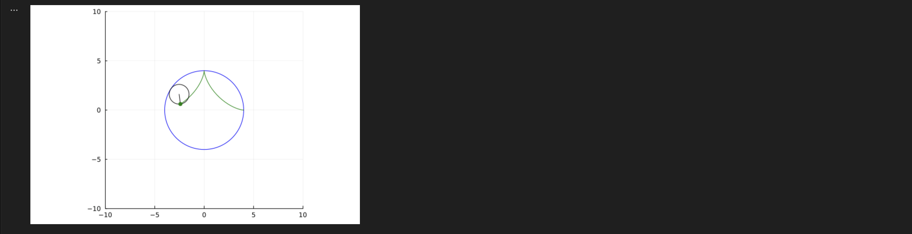{ #fig:066 width=100% height=100% }

{ #fig:067 width=100% height=100% }

Выполнение задания №11 (рис. [-@fig:068] - рис. [-@fig:073]):

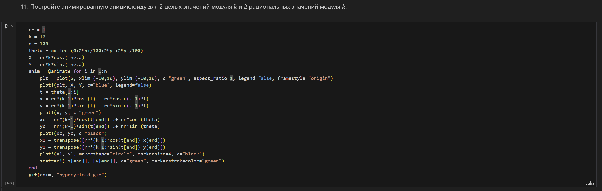{ #fig:068 width=100% height=100% }

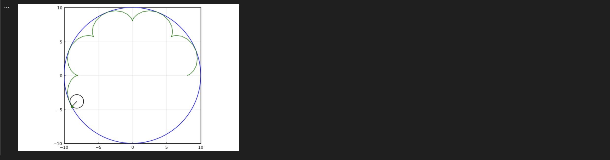{ #fig:069 width=100% height=100% }

{ #fig:070 width=100% height=100% }

{ #fig:071 width=100% height=100% }

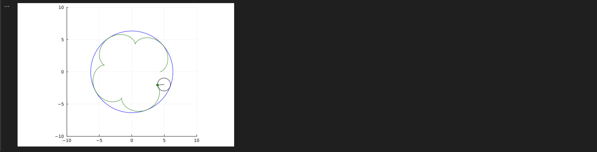{ #fig:072 width=100% height=100% }

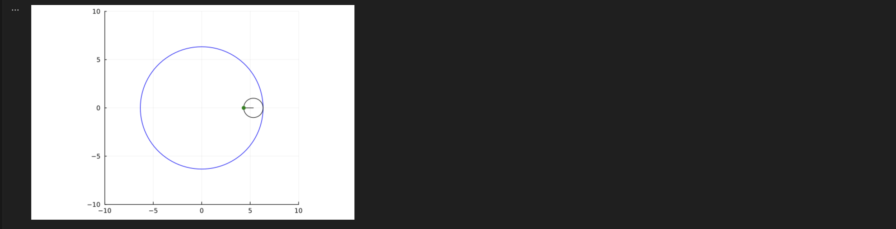{ #fig:073 width=100% height=100% }

# Выводы

В результате выполнения данной лабораторной работы я освоил синтаксис языка Julia для построения графиков.

# Список литературы{.unnumbered}

::: {#refs}
:::