---
## Front matter
lang: ru-RU
title: Лабораторная работа №6
subtitle: "Решение моделей в непрерывном и дискретном времени"
author:
  - Дурдалыев Максат
teacher:
  - Кулябов Д. С.
  - д.ф.-м.н., профессор
  - профессор кафедры теории вероятностей и кибербезопасности 
institute:
  - Российский университет дружбы народов имени Патриса Лумумбы, Москва, Россия
date: today
date-format: "YYYY-MM-DD" # Example: 2025-09-06

## i18n babel
babel-lang: russian
babel-otherlangs: english
---

## Докладчик

:::::::::::::: {.columns align=center}
::: {.column width="70%"}

  * Дурдалыев Максат
  * Cтудент НКНбд-01-22
  * Российский университет дружбы народов имени Патриса Лумумбы
  * [1132205337@pfur.ru](mailto:1132205337@pfur.ru)
  * <https://github.com/mdurdalyyev>

:::
::: {.column width="30%"}

:::
::::::::::::::

## Цели и задачи

**Цель работы**

Основной целью работы является освоение специализированных пакетов для решения задач в непрерывном и дискретном времени.

**Задание**

1. Используя Jupyter Lab, повторите примеры.

2. Выполните задания для самостоятельной работы.

## Решение обыкновенных дифференциальных уравнений

Вспомним, что обыкновенное дифференциальное уравнение (ОДУ) описывает изменение некоторой переменной u.

Для решения обыкновенных дифференциальных уравнений (ОДУ) в Julia можно использовать пакет diffrentialEquations.jl.

## Модель экспоненциального роста

{ #fig:001 width=100% height=100% }

## Модель экспоненциального роста

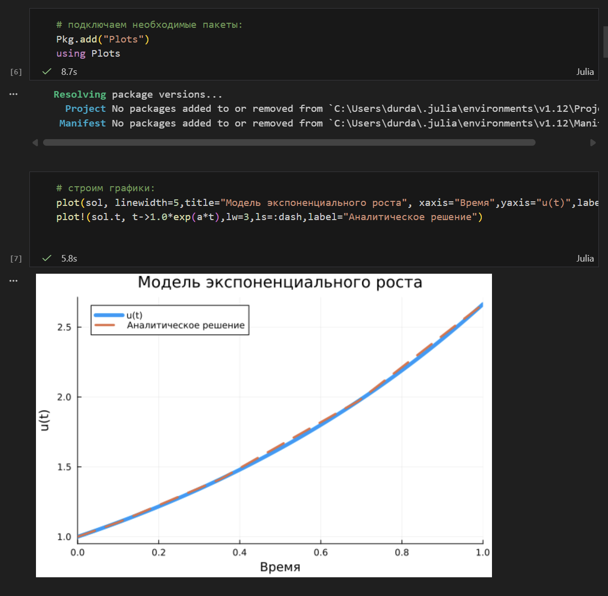{ #fig:002 width=100% height=100% }

## Модель экспоненциального роста

{ #fig:003 width=100% height=100% }

## Система Лоренца

Динамической системой Лоренца является нелинейная автономная система обыкновенных дифференциальных уравнений третьего порядка.

Система получена из системы уравнений Навье–Стокса и описывает движение воздушных потоков в плоском слое жидкости постоянной толщины при разложении скорости течения и температуры в двойные ряды Фурье с последующем усечением до первых-вторых гармоник.

Решение системы неустойчиво на аттракторе, что не позволяет применять классические численные методы на 
больших отрезках времени, требуется использовать высокоточные вычисления.

## Система Лоренца

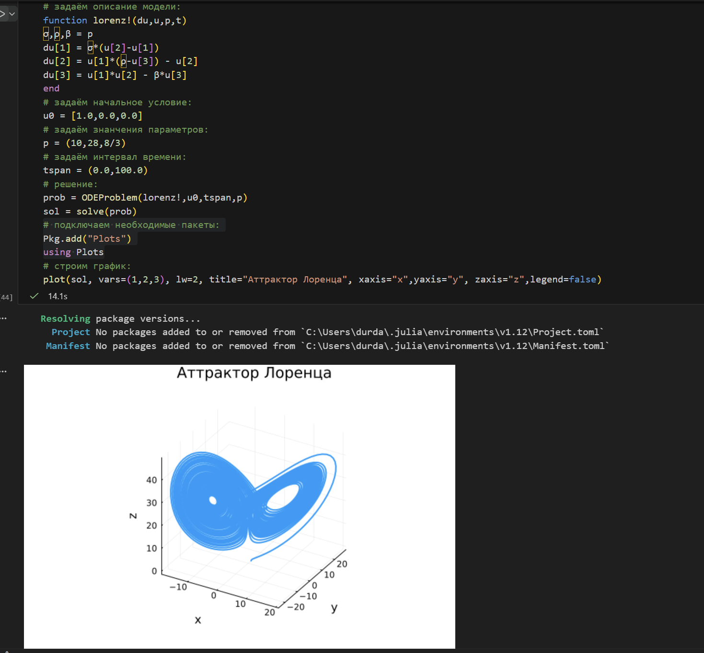{ #fig:004 width=80% height=80% }

## Система Лоренца

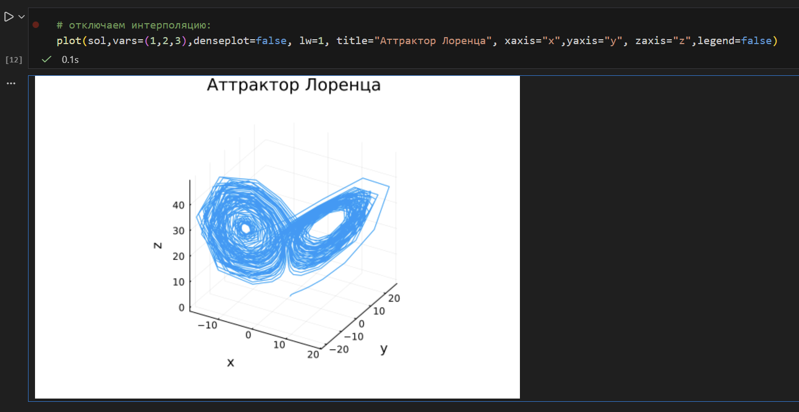{ #fig:005 width=100% height=100% }

## Модель Лотки–Вольтерры

{ #fig:006 width=80% height=80% }

## Модель Лотки–Вольтерры

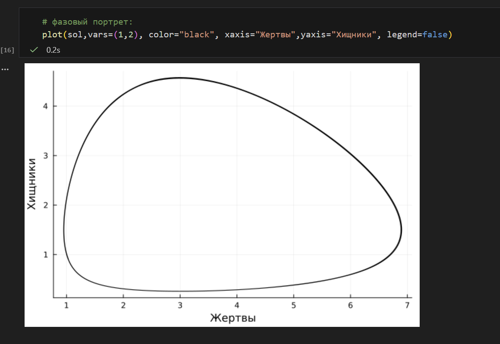{ #fig:007 width=100% height=100% }

## Самостоятельное выполнение

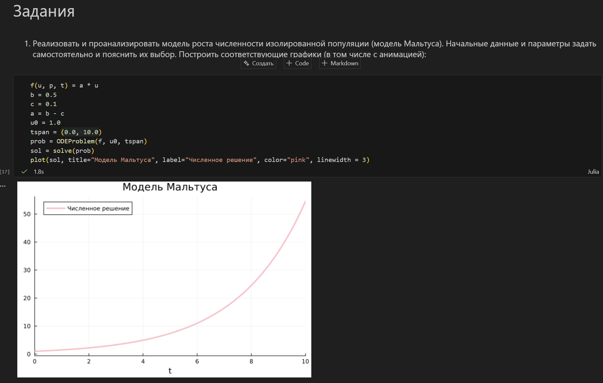{ #fig:008 width=80% height=80% }

## Самостоятельное выполнение

{ #fig:009 width=100% height=100% }

## Самостоятельное выполнение

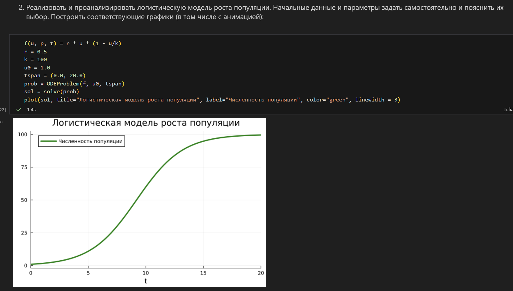{ #fig:010 width=80% height=80% }

## Самостоятельное выполнение

{ #fig:011 width=100% height=100% }

## Самостоятельное выполнение

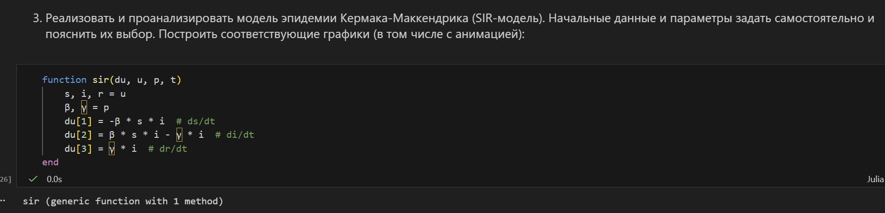{ #fig:012 width=100% height=100% }

## Самостоятельное выполнение

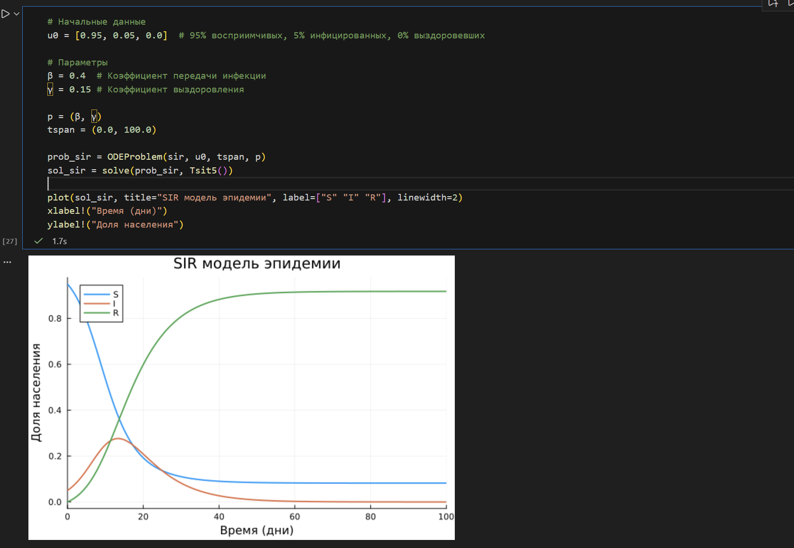{ #fig:013 width=100% height=100% }

## Самостоятельное выполнение

{ #fig:014 width=80% height=80% }

## Самостоятельное выполнение

{ #fig:015 width=100% height=100% }

## Самостоятельное выполнение

{ #fig:016 width=100% height=100% }

## Самостоятельное выполнение

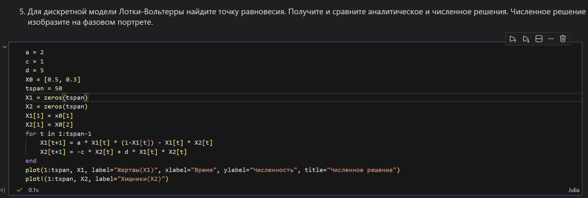{ #fig:017 width=100% height=100% }

## Самостоятельное выполнение

{ #fig:018 width=100% height=100% }

## Самостоятельное выполнение

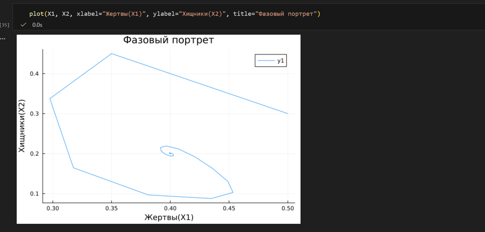{ #fig:019 width=100% height=100% }

## Самостоятельное выполнение

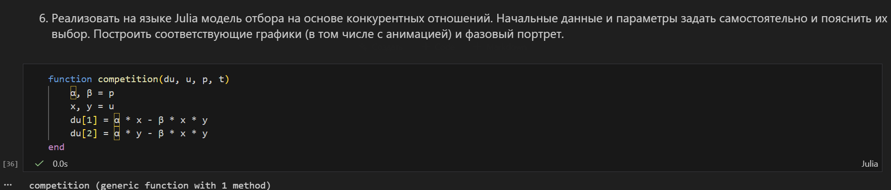{ #fig:020 width=100% height=100% }

## Самостоятельное выполнение

{ #fig:021 width=100% height=100% }

## Самостоятельное выполнение

{ #fig:022 width=100% height=100% }

## Самостоятельное выполнение

{ #fig:023 width=100% height=100% }

## Самостоятельное выполнение

{ #fig:024 width=100% height=100% }

## Самостоятельное выполнение

{ #fig:025 width=100% height=100% }

## Самостоятельное выполнение

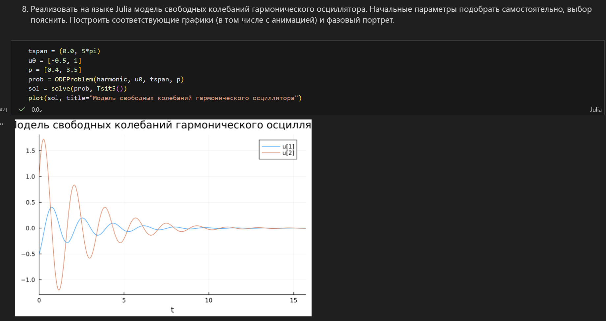{ #fig:026 width=100% height=100% }

## Самостоятельное выполнение

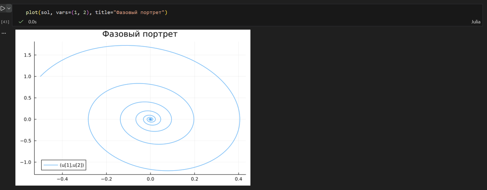{ #fig:027 width=100% height=100% }

## Выводы

В результате выполнения данной лабораторной работы я освоил специализированные пакеты для решения задач в непрерывном и дискретном времени.