---
## Front matter
title: "Лабораторная работа №6"
subtitle: "Решение моделей в непрерывном и дискретном времени"
author: "Дурдалыев Максат"
---

# Введение

## Цели и задачи

**Цель работы**

Основной целью работы является освоение специализированных пакетов для решения задач в непрерывном и дискретном времени[@julialang].

**Задание**

1. Используя Jupyter Lab, повторите примеры.

2. Выполните задания для самостоятельной работы[@juliadoc].

# Выполнение лабораторной работы

## Решение обыкновенных дифференциальных уравнений

Вспомним, что обыкновенное дифференциальное уравнение (ОДУ) описывает изменение некоторой переменной u.

Для решения обыкновенных дифференциальных уравнений (ОДУ) в Julia можно использовать пакет diffrentialEquations.jl.

## Модель экспоненциального роста

Рассмотрим пример использования этого пакета для решение уравнения модели экспоненциального роста, описываемую уравнением, где a — коэффициент роста. 

Численное решение в Julia будет иметь следующий вид, а также график, 
соответствующий полученному решению (рис. [-@fig:001] - рис. [-@fig:002]):

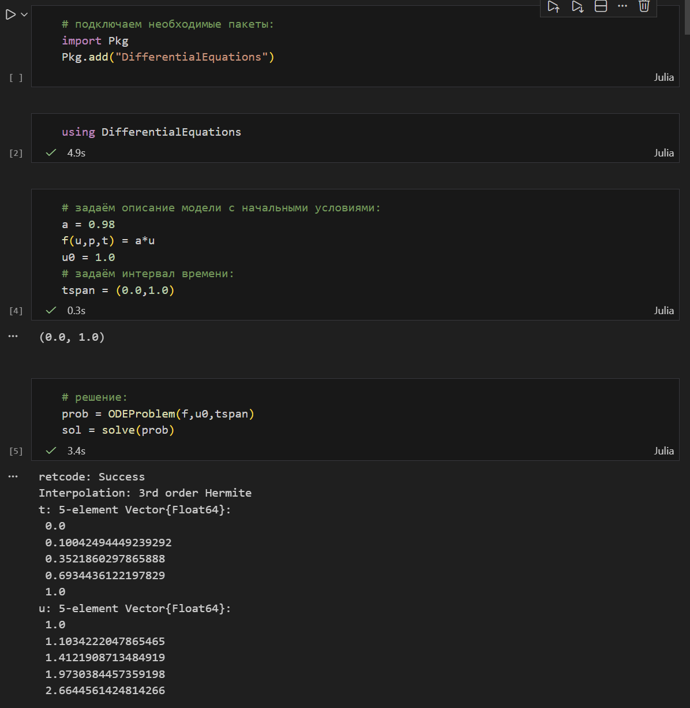{ #fig:001 width=100% height=100% }

{ #fig:002 width=100% height=100% }

При построении одного из графиков использовался вызов sol.t, чтобы захватить массив моментов времени. Массив решений можно получить, воспользовавшись sol.u.

Если требуется задать точность решения, то можно воспользоваться параметрами abstol (задаёт близость к нулю) и reltol (задаёт относительную точность). По умолчанию эти параметры 
имеют значение abstol = 1e-6 и reltol = 1e-3.

Для модели экспоненциального роста (рис. [-@fig:003]):

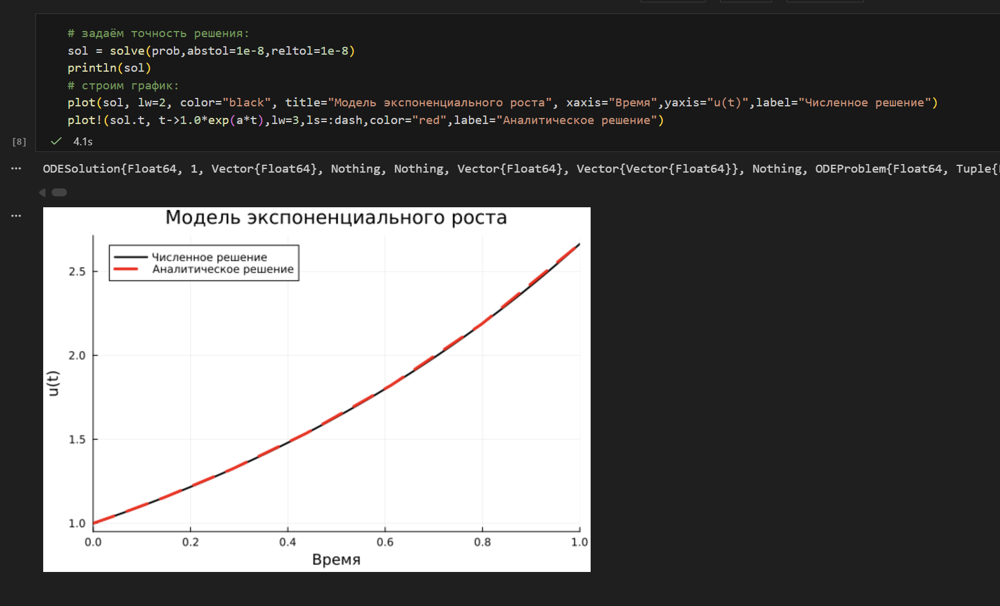{ #fig:003 width=100% height=100% }

## Система Лоренца

Динамической системой Лоренца является нелинейная автономная система обыкновенных дифференциальных уравнений третьего порядка.

Система получена из системы уравнений Навье–Стокса и описывает движение воздушных потоков в плоском слое жидкости постоянной толщины при разложении скорости течения и температуры в двойные ряды Фурье с последующем усечением до первых-вторых гармоник.

Решение системы неустойчиво на аттракторе, что не позволяет применять классические численные методы на больших отрезках времени, требуется использовать высокоточные вычисления.

Численное решение в Julia будет иметь следующий вид (рис. [-@fig:004]):

{ #fig:004 width=100% height=100% }

Можно отключить интерполяцию (рис. [-@fig:005]):

{ #fig:005 width=100% height=100% }

## Модель Лотки–Вольтерры

Модель Лотки–Вольтерры описывает взаимодействие двух видов типа «хищник – жертва».

Численное решение в Julia будет иметь следующий вид (рис. [-@fig:006]):

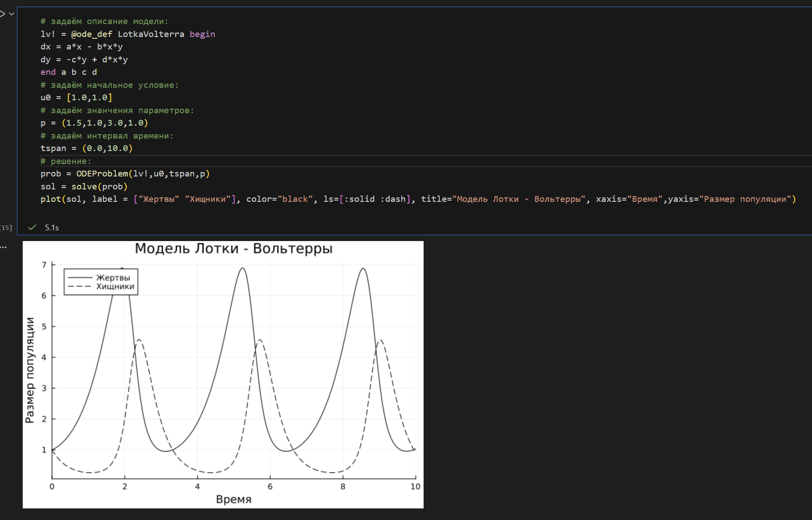{ #fig:006 width=100% height=100% }

Фазовый портрет (рис. [-@fig:007]):

{ #fig:007 width=100% height=100% }

## Самостоятельное выполнение

Выполнение задания №1 (рис. [-@fig:008] - рис. [-@fig:009]):

{ #fig:008 width=100% height=100% }

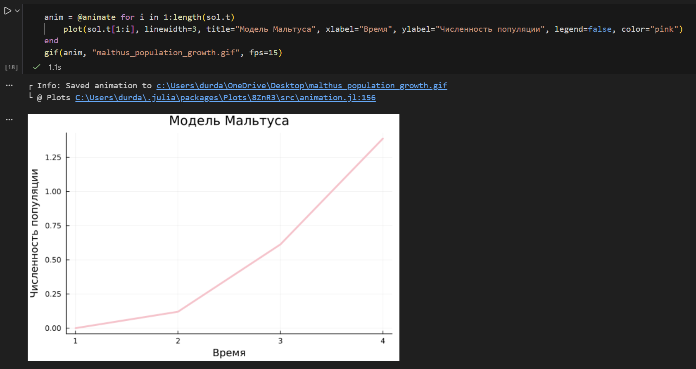{ #fig:009 width=100% height=100% }

Выполнение задания №2 (рис. [-@fig:010] - рис. [-@fig:011]):

{ #fig:010 width=100% height=100% }

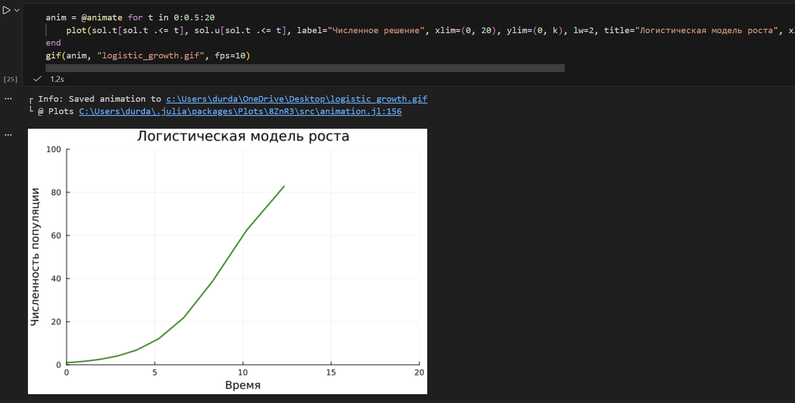{ #fig:011 width=100% height=100% }

Выполнение задания №3 (рис. [-@fig:012] - рис. [-@fig:014]):

{ #fig:012 width=100% height=100% }

{ #fig:013 width=100% height=100% }

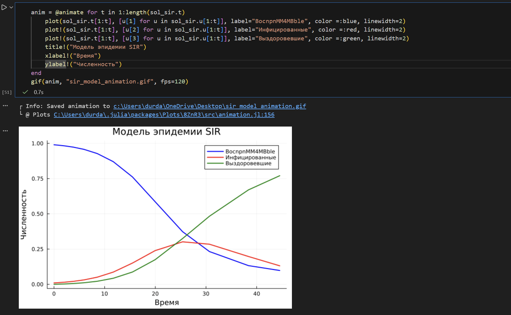{ #fig:014 width=100% height=100% }

Выполнение задания №4 (рис. [-@fig:015] - рис. [-@fig:016]):

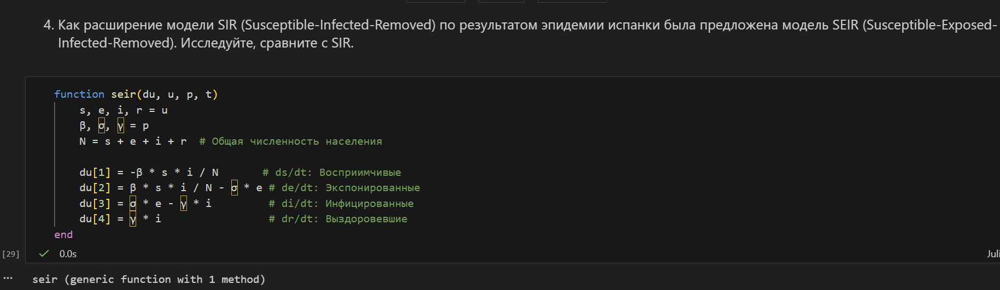{ #fig:015 width=100% height=100% }

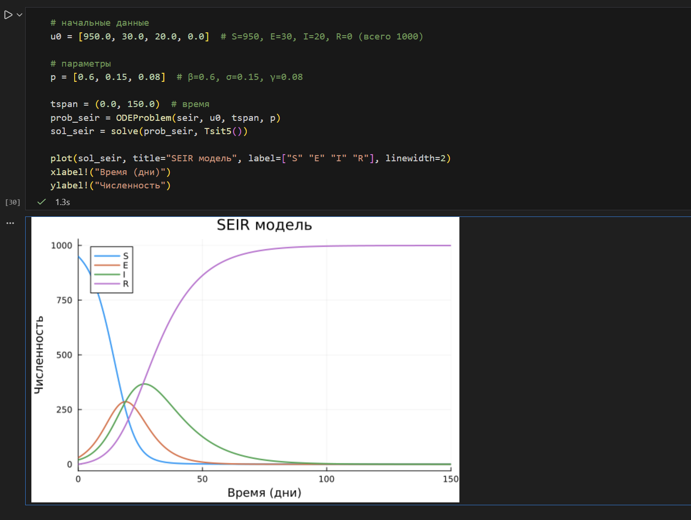{ #fig:016 width=100% height=100% }

Выполнение задания №5 (рис. [-@fig:017] - рис. [-@fig:019]):

{ #fig:017 width=100% height=100% }

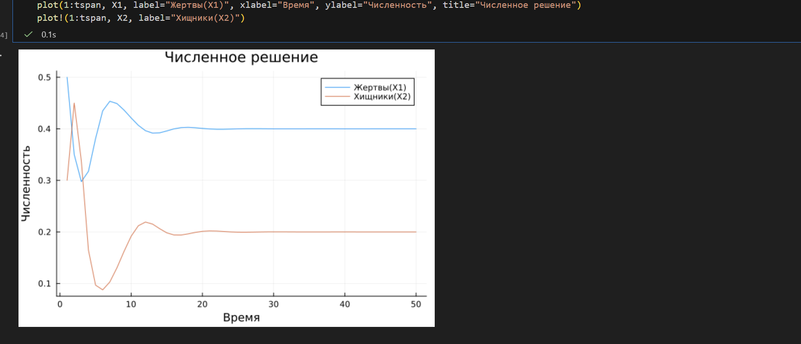{ #fig:018 width=100% height=100% }

{ #fig:019 width=100% height=100% }

Выполнение задания №6 (рис. [-@fig:020] - рис. [-@fig:022]):

{ #fig:020 width=100% height=100% }

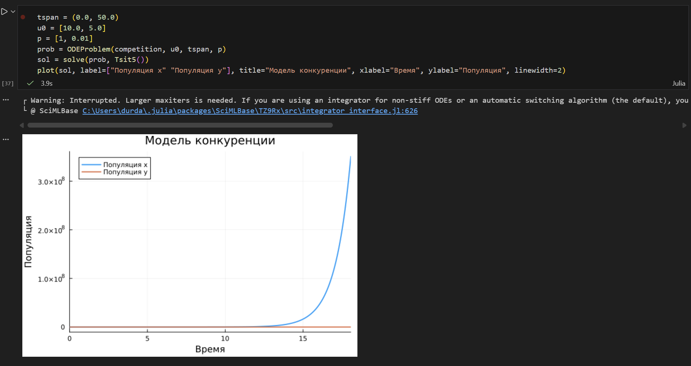{ #fig:021 width=100% height=100% }

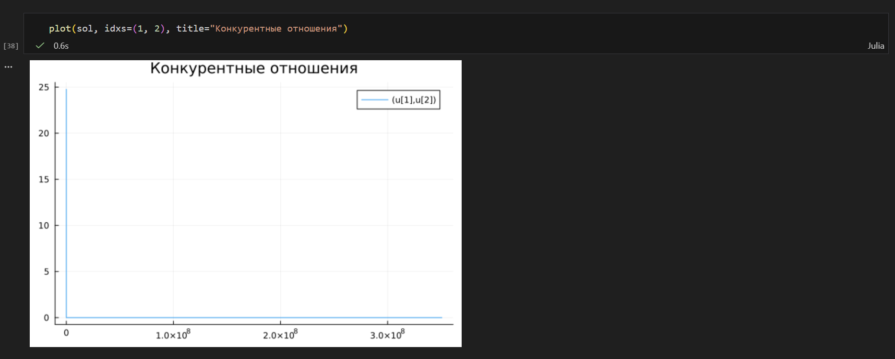{ #fig:022 width=100% height=100% }

Выполнение задания №7 (рис. [-@fig:023] - рис. [-@fig:025]):

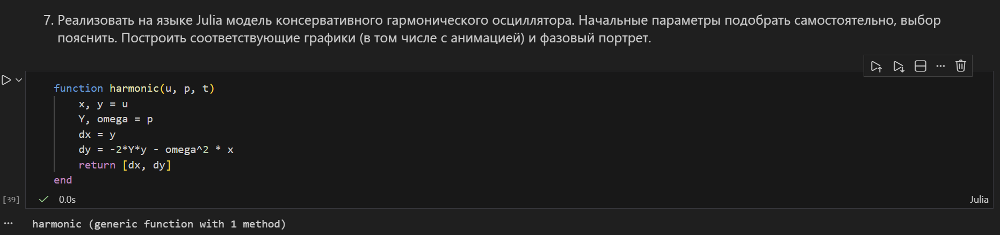{ #fig:023 width=100% height=100% }

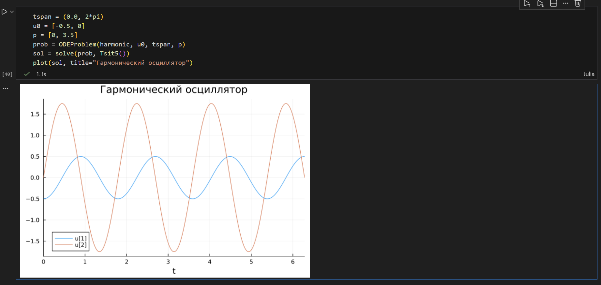{ #fig:024 width=100% height=100% }

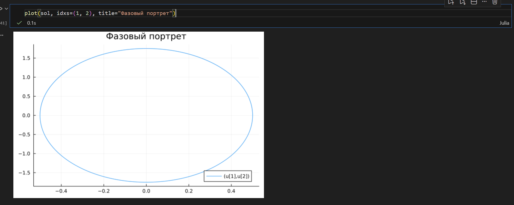{ #fig:025 width=100% height=100% }

Выполнение задания №8 (рис. [-@fig:026] - рис. [-@fig:027]):

{ #fig:026 width=100% height=100% }

{ #fig:027 width=100% height=100% }

# Выводы

В результате выполнения данной лабораторной работы я освоил специализированные пакеты для решения задач в непрерывном и дискретном времени.

# Список литературы{.unnumbered}

::: {#refs}
:::