---
## Front matter
title: "Лабораторная работа №7"
subtitle: "Введение в работу с данными"
author: "Дурдалыев Максат"
---

# Введение

## Цели и задачи

**Цель работы**

Основной целью работы является специализированных пакетов Julia для обработки данных[@julialang].

**Задание**

1. Используя Jupyter Lab, повторите примеры.

2. Выполните задания для самостоятельной работы[@juliadoc].

# Выполнение лабораторной работы

## Julia для науки о данных

В Julia для обработки данных используются наработки из других языков программирования, в частности, из R и Python.

## Считывание данных

Перед тем, как начать проводить какие-либо операции над данными, необходимо их откуда-то считать и 
возможно сохранить в определённой структуре. 

Довольно часто данные для обработки содержаться в csv-файле, имеющим текстовый формат, в котором 
данные в строке разделены, например, запятыми, и соответствуют ячейкам таблицы, а строки данных 
соответствуют строкам таблицы. Также данные могут быть представлены в виде фреймов или множеств.

В Julia для работы с такого рода структурами данных используют пакеты CSV, DataFrames, RDatasets, FileIO (рис. [-@fig:001]):

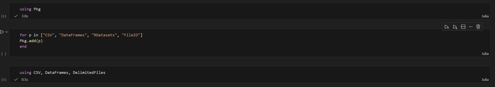{ #fig:001 width=100% height=100% }

Предположим, что у нас в рабочем каталоге с проектом есть файл с данными programminglanguages.csv, содержащий перечень языков программирования и год их создания. Тогда для заполнения массива данными для последующей обработки требуется считать данные из исходного файла и записать их в соответствующую 
структуру (рис. [-@fig:002]):

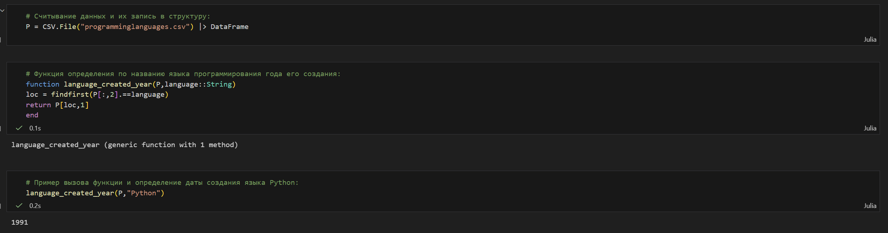{ #fig:002 width=100% height=100% }

Пример для Julia (рис. [-@fig:003]):

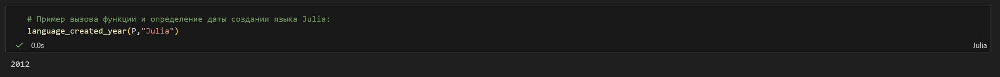{ #fig:003 width=100% height=100% }

В следующем примере при вызове функции, в качестве аргумента которой указано слово julia, написанное со строчной буквы (рис. [-@fig:004]):

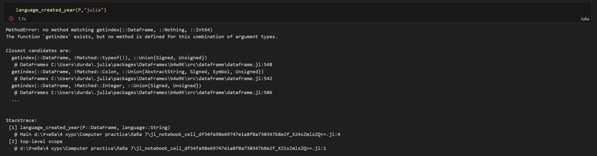{ #fig:004 width=100% height=100% }

Для того, чтобы убрать в функции зависимость данных от регистра, необходимо изменить исходную функцию следующим образом (рис. [-@fig:005]):

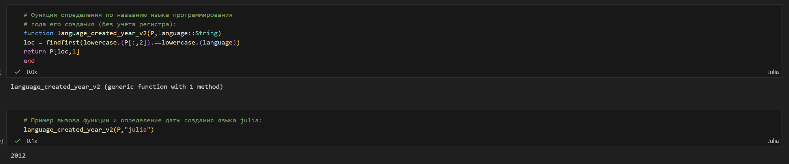{ #fig:005 width=100% height=100% }

Можно считывать данные построчно, с элементами, разделенными заданным разделителем (рис. [-@fig:006]):

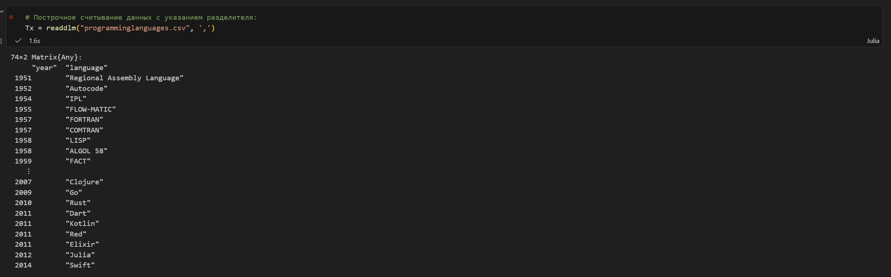{ #fig:006 width=100% height=100% }

## Запись данных в файл

Предположим, что требуется записать имеющиеся данные в файл. Для записи данных в формате CSV можно 
воспользоваться следующим вызовом (рис. [-@fig:007]):

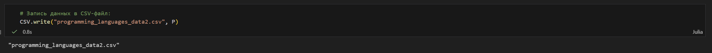{ #fig:007 width=100% height=100% }

Можно задать тип файла и разделитель данных (рис. [-@fig:008]):

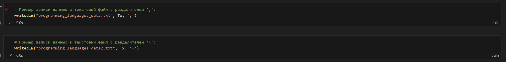{ #fig:008 width=100% height=100% }

Можно проверить, используя readdlm, корректность считывания созданного текстового файла (рис. [-@fig:009]):

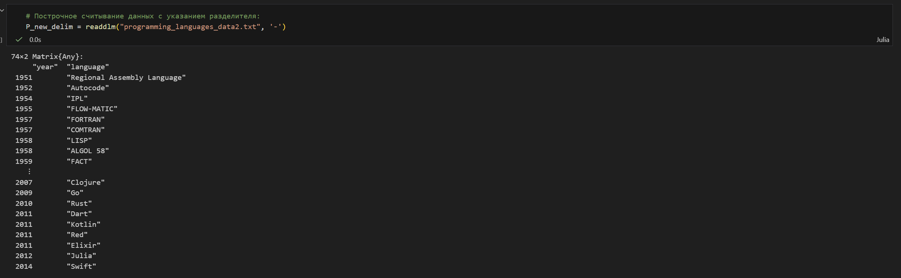{ #fig:009 width=100% height=100% }

## Словари

При работе с данными бывает удобно записать их в формате словаря.

Предположим, что словарь должен содержать перечень всех языков программирования и года их создания, 
при этом при указании года выводить все языки программирования, созданные в этом году.

При инициализации словаря можно задать конкретные типы данных для ключей и значений (рис. [-@fig:010]):

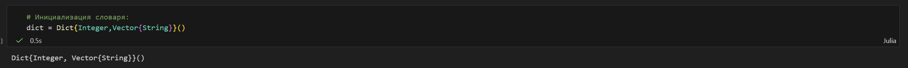{ #fig:010 width=100% height=100% }

Можно инициировать пустой словарь, не задавая строго структуру (рис. [-@fig:011]):

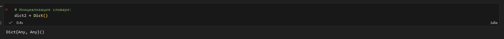{ #fig:011 width=100% height=100% }

Далее требуется заполнить словарь ключами и годами, которые содержат все языки программирования, 
созданные в каждом году, в качестве значений (рис. [-@fig:012]):

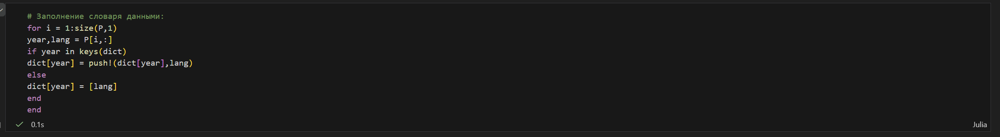{ #fig:012 width=100% height=100% }

В результате при вызове словаря можно, выбрав любой год, узнать, какие языки программирования были созданы в этом году (рис. [-@fig:013]):

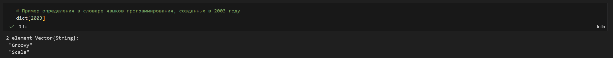{ #fig:013 width=100% height=100% }

## DataFrames

Работа с данными, записанными в структуре DataFrame, позволяет использовать индексацию и получить доступ к столбцам по заданному имени заголовка или по индексу столбца.

На примере с данными о языках программирования и годах их создания зададим структуру DataFrame (рис. [-@fig:014]):

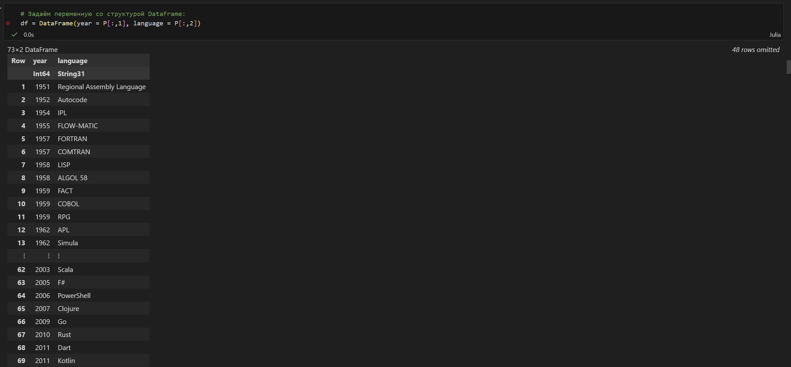{ #fig:014 width=100% height=100% }

Если требуется получить доступ к столбцам по имени заголовка, то необходимо добавить к имени заголовка двоеточие. В Julia это означает, что имена заголовков обрабатываются как символы. Также следует
иметь в виду, что вызов df[1] эквивалентен вызову df [:year].
Пакет DataFrames предоставляет возможность с помощью description получить основные статистические сведения о каждом столбце во фрейме данных(рис. [-@fig:015]).

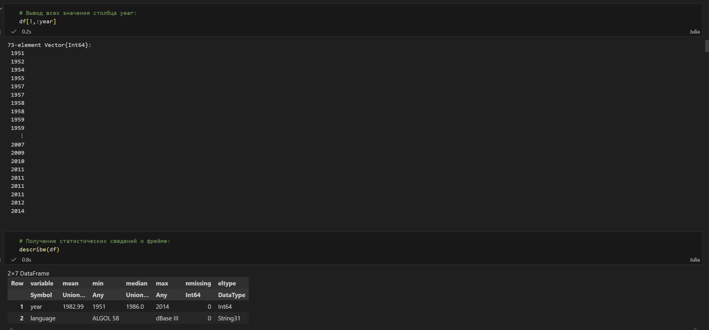{ #fig:015 width=100% height=100% }

## RDatasets

С данными можно работать также как с наборами данных через пакет RDatasets языка R (рис. [-@fig:016]):

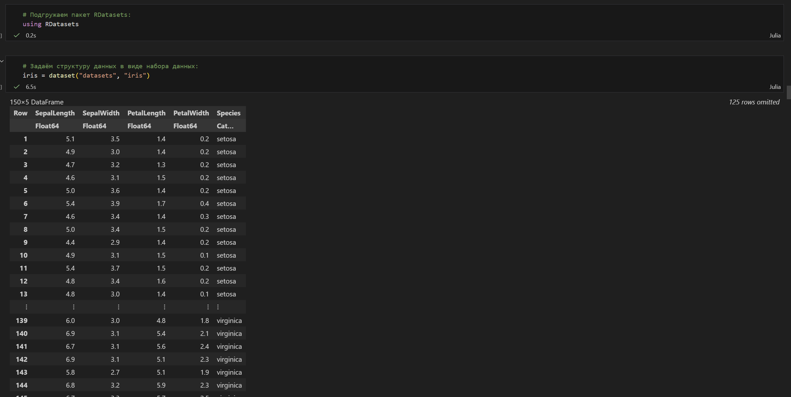{ #fig:016 width=100% height=100% }

Пакет RDatasets также предоставляет возможность с помощью description получить основные статистические 
сведения о каждом столбце в наборе данных (рис. [-@fig:017]):

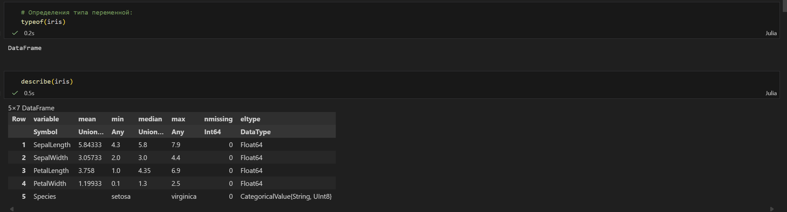{ #fig:017 width=100% height=100% }

## Работа с переменными отсутствующего типа (Missing Values)

Пакет DataFrames позволяет использовать так называемый «отсутствующий» тип (рис. [-@fig:018]). В операции сложения числа и переменной с отсутствующим типом значение также будет иметь отсутствующий тип.

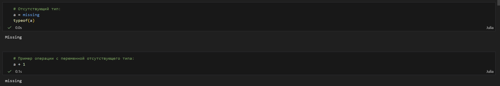{ #fig:018 width=100% height=100% }

Приведём пример работы с данными, среди которых есть данные с отсутствующим типом.

Предположим есть перечень продуктов, для которых заданы калории. В массиве значений калорий есть значение с отсутствующим 
типом (рис. [-@fig:019]):

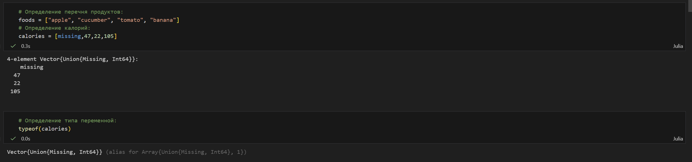{ #fig:019 width=100% height=100% }

При попытке получить среднее значение калорий, ничего не получится из-за наличия переменной с отсутствующим типом.

Для решения этой проблемы необходимо игнорировать отсутствующий тип (рис. [-@fig:020]):

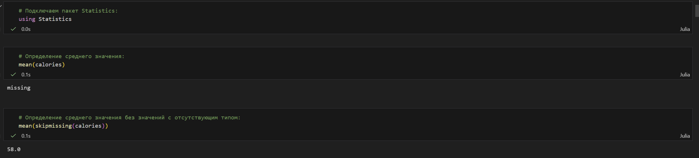{ #fig:020 width=100% height=100% }

Далее показано, как можно сформировать таблицы данных и объединить их в один фрейм (рис. [-@fig:021]):

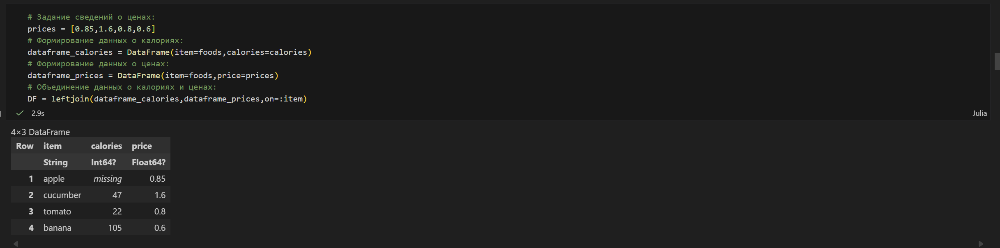{ #fig:021 width=100% height=100% }

## FileIO

В Julia можно работать с так называемыми «сырыми» данными, используя пакет FileIO. 

Попробуем посмотреть, как Julia работает с изображениями.

Подключим соответствующий пакет. Загрузим изображение (в данном случае логотип Julia)(рис. [-@fig:022]):

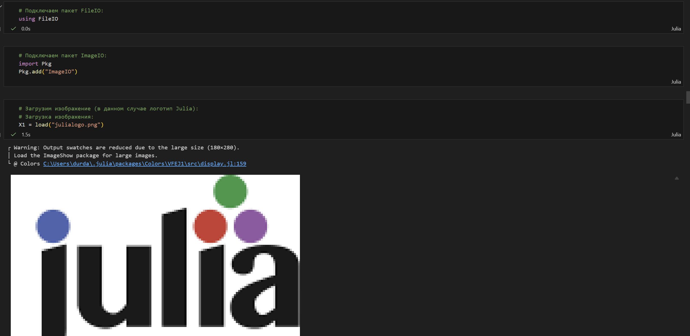{ #fig:022 width=100% height=100% }

## Обработка данных: стандартные алгоритмы машинного обучения в Julia. Кластеризация данных. Метод k-средних

Задача кластеризации данных заключается в формировании однородной группы упорядоченных по какому-то признаку данных.

Метод k-средних позволяет минимизировать суммарное квадратичное отклонение точек кластеров от центров этих кластеров.

Рассмотрим задачу кластеризации данных на примере данных о недвижимости. Файл с данными houses.csv 
содержит список транзакций с недвижимостью в районе Сакраменто, о которых было сообщено в течение 
определённого числа дней.

Загрузим данные (рис. [-@fig:023]):

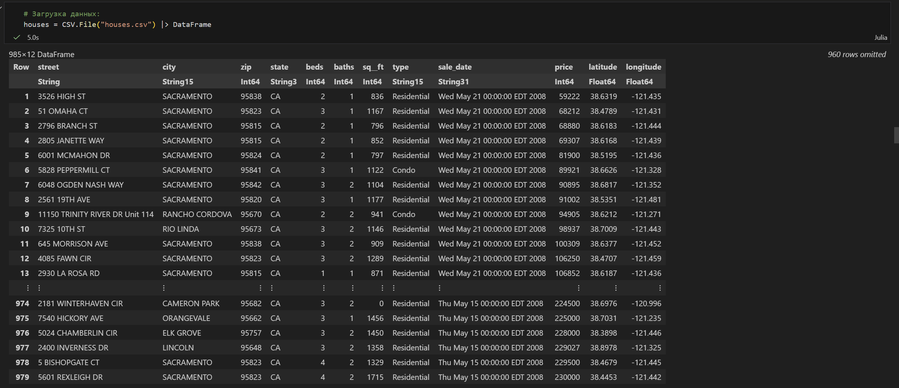{ #fig:023 width=100% height=100% }

Построим график цен на недвижимость в зависимости от площади (рис. [-@fig:024]):

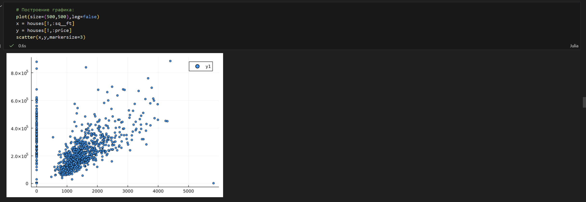{ #fig:024 width=100% height=100% }

Для того чтобы избавиться от "артефактов", можно отфильтровать и исключить такие значения, получить более корректный график цен(рис. [-@fig:025]):

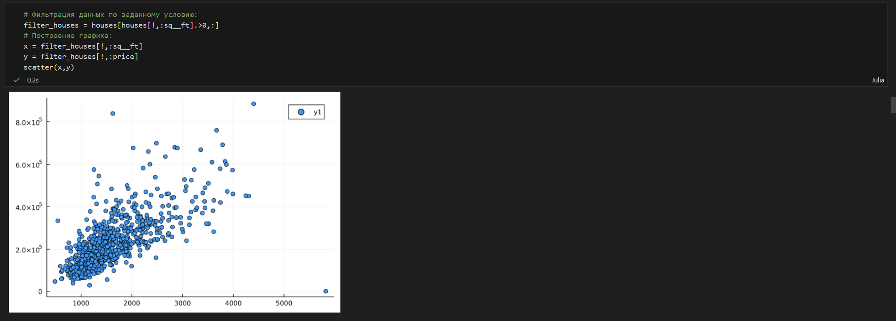{ #fig:025 width=100% height=100% }

Используя для фильтрации значений функцию by пакета DataFrames и для вычисления
среднего значения функцию mean пакета Statistics, можно посмотреть среднюю цену
домов определённого типа(рис. [-@fig:026]). 

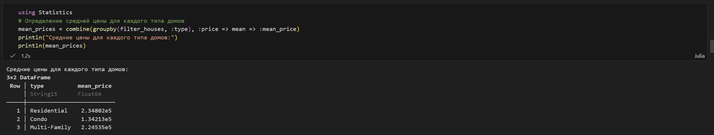{ #fig:026 width=100% height=100% }

Построим график, обозначив каждый кластер отдельным цветом (рис. [-@fig:027] - рис. [-@fig:028]):

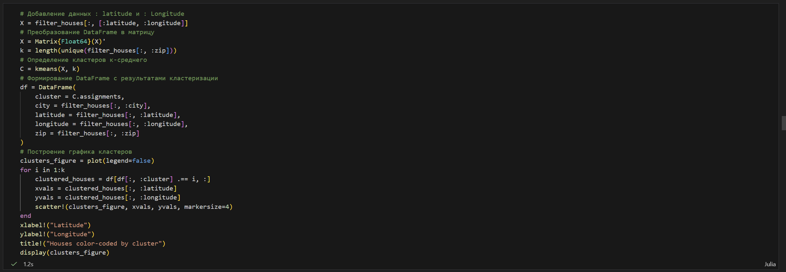{ #fig:027 width=100% height=100% }

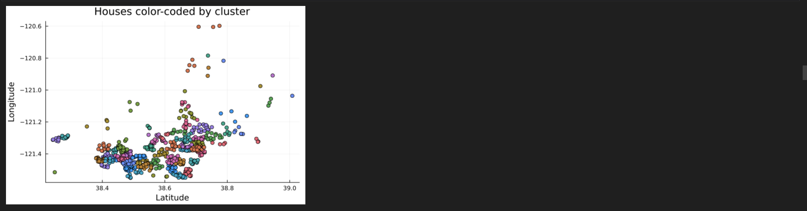{ #fig:028 width=100% height=100% }

Построим график, раскрасив кластеры по почтовому индексу (рис. [-@fig:029]):

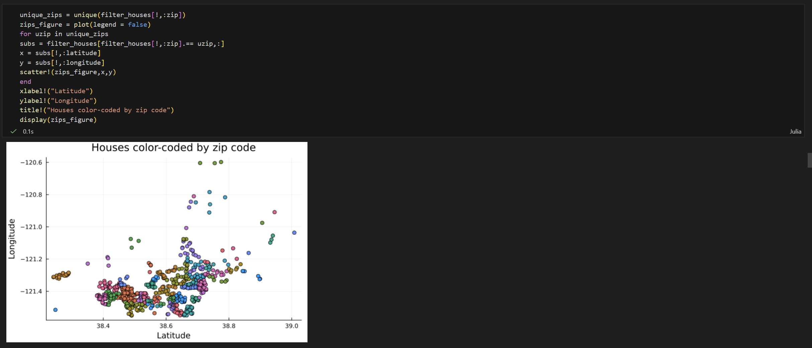{ #fig:029 width=100% height=100% }

## Кластеризация данных. Метод k ближайших соседей

Отобразим на графике соседей выбранного объекта недвижимости (рис. [-@fig:030]):

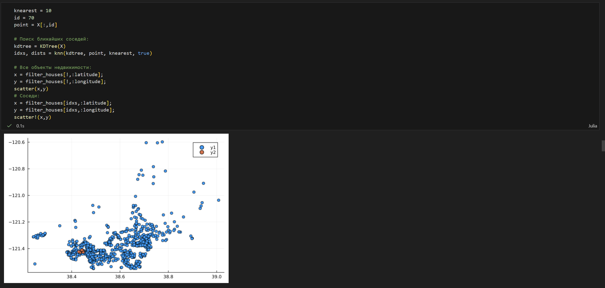{ #fig:030 width=100% height=100% }

Используя индексы idxs и функцию :city для индексации в DataFrame filter_houses, можно определить 
районы соседних домов (рис. [-@fig:031]):

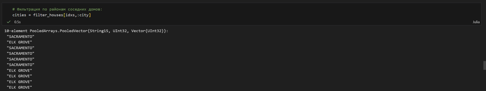{ #fig:031 width=100% height=100% }

## Обработка данных. Метод главных компонент

Метод главных компонент (Principal Components Analysis, PCA) позволяет уменьшить размерность данных, 
потеряв наименьшее количество полезной информации. Метод имеет широкое применение в различных областях 
знаний, например, при визуализации данных, компрессии изображений, в эконометрике, некоторых 
гуманитарных предметных областях, например, в социологии или в политологии.

На примере с данными о недвижимости попробуем уменьшить размеры данных о цене и площади из набора 
данных домов (рис. [-@fig:032]):

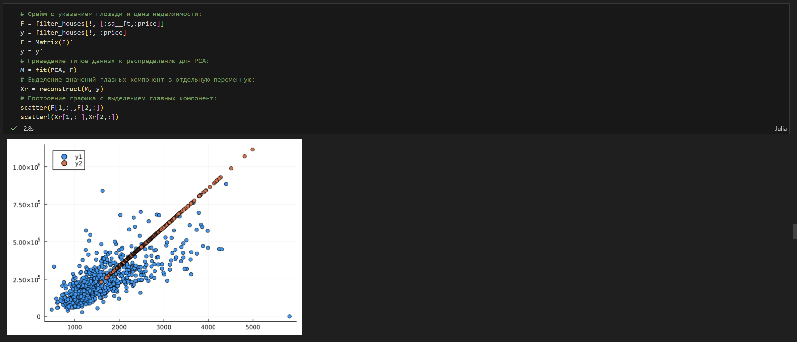{ #fig:032 width=100% height=100% }

## Обработка данных. Линейная регрессия

Регрессионный анализ представляет собой набор статистических методов исследования влияния одной или нескольких независимых 
переменных (регрессоров) на зависимую (критериальная) переменную. Терминология зависимых и независимых
переменных отражает лишь математическую зависимость переменных, а не причинноследственные отношения.

Наиболее распространённый вид регрессионного анализа — линейная регрессия, когда находят линейную 
функцию, которая согласно определённым математическим критериям наиболее соответствует данным.

Зададим случайный набор данных (можно использовать и полученные экспериментальным путём какие-то данные). 
Попробуем найти для данных лучшее соответствие (рис. [-@fig:033]):

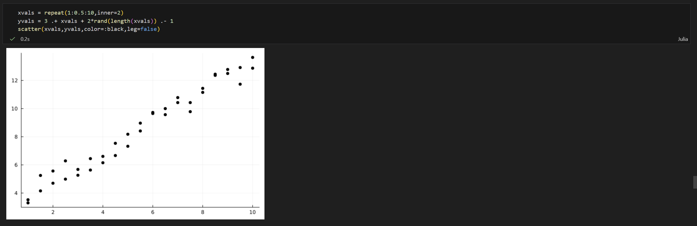{ #fig:033 width=100% height=100% }

Определим функцию линейной регрессии. Применим функцию линейной регрессии для построения 
соответствующего графика значений (рис. [-@fig:034]):

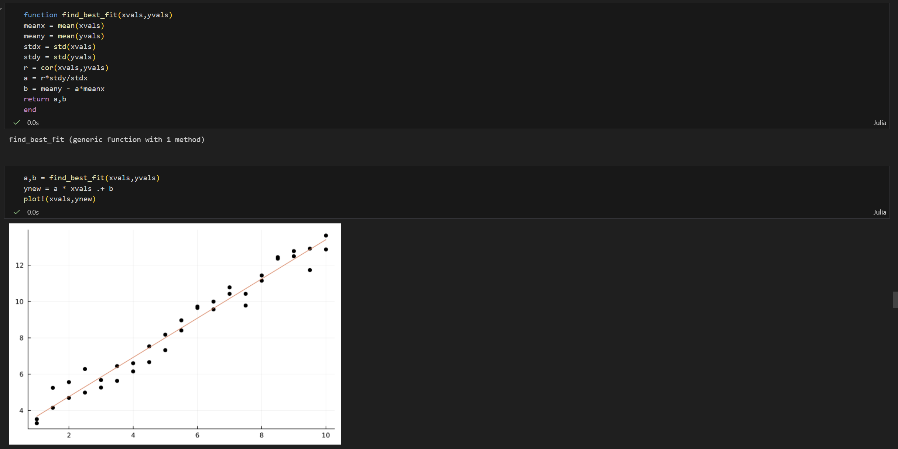{ #fig:034 width=100% height=100% }

Сгенерируем больший набор данных. Определим, сколько времени потребуется, чтобы найти соответствие 
этим данным. Для сравнения реализуем подобный код на языке Python. Используем пакет для анализа производительности, 
чтобы провести сравнение (рис. [-@fig:035] - рис. [-@fig:036]):

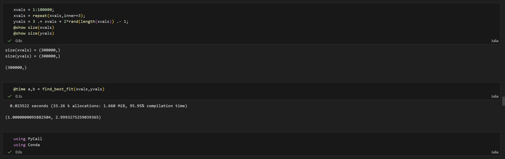{ #fig:035 width=100% height=100%}

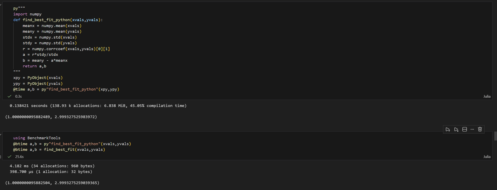{ #fig:036 width=100% height=100%}

## Самостоятельное выполнение

Загрузим

```Julia
using RDatasets
iris = dataset("datasets", "iris")
```

Используем Clustering.jl для кластеризации на основе k-средних. Сделаем точечную диаграмму полученных кластеров. Для этого проиндексируем фрейм данных, преобразуем его
в массив и транспонируем (рис. [-@fig:037] - рис. [-@fig:039]).

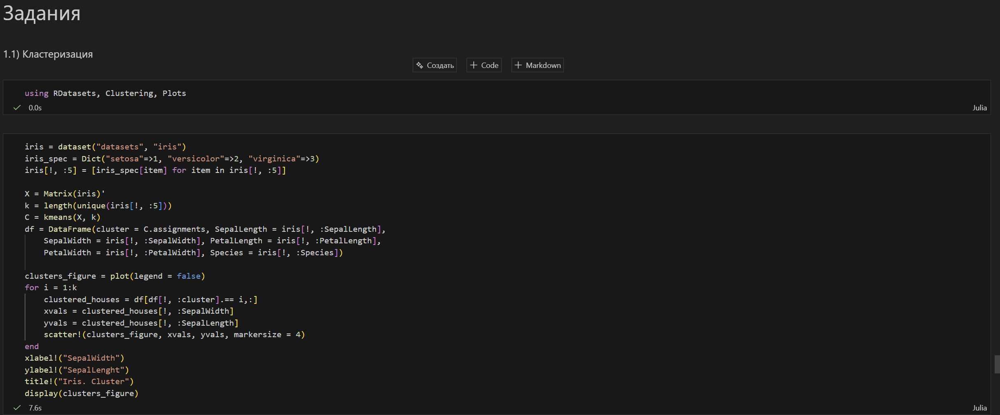{#fig:037 width=70%}

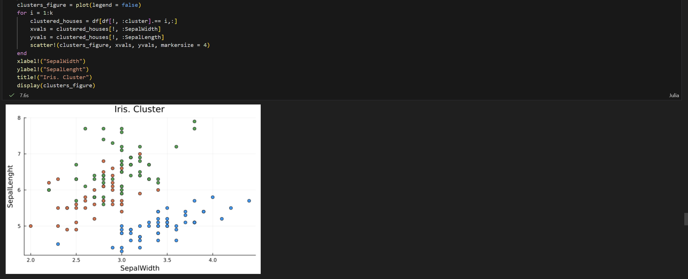{#fig:038 width=70%}

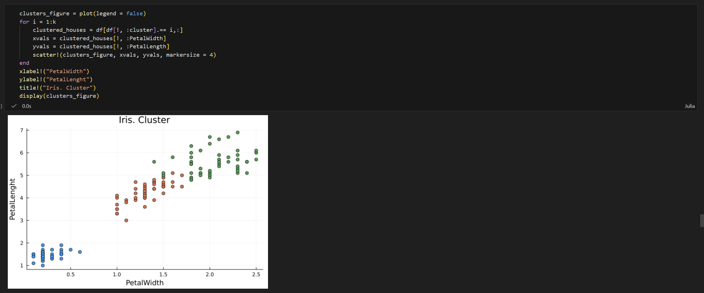{#fig:039 width=70%}

Пусть регрессионная зависимость являетсял инейной. Матрица наблюдений факторов $X$ имеет размерность $N \times 3$ `randn (N, 3)`, массив результато в $N \times 1$, регрессионная зависимость является линейной.Найдем МНК-оценку для линейной модели(рис. [-@fig:040] - рис. [-@fig:041]).

- Сравним свои результаты с результатами использования `llsq` из
`MultivariateStats.jl`.
- Сравним свои результаты с результатамии спользования регулярной регрессии наименьших квадратов из `GLM.jl`.

Cоздадим матрицу данных $X2$, которая добавляет столбец единиц в начало матрицы данных, и решим систему линейных уравнений.

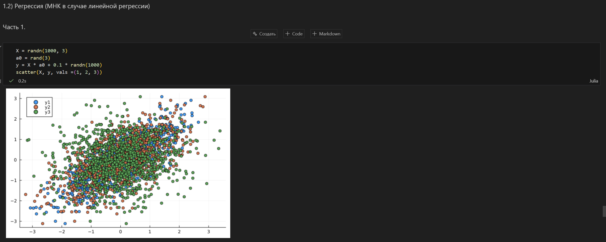{#fig:040 width=70%}

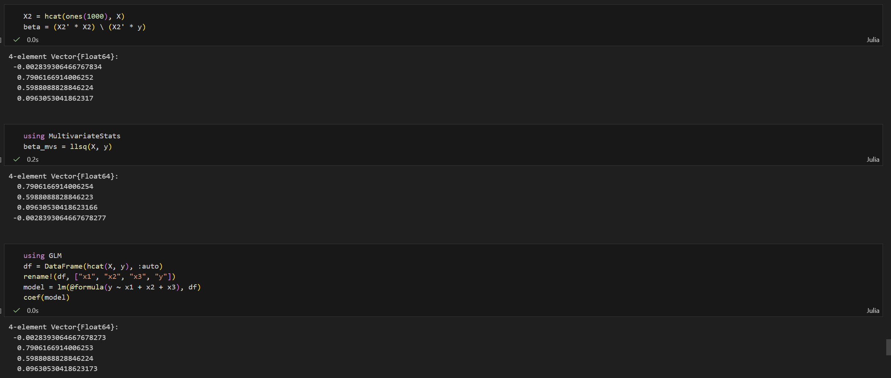{#fig:041 width=70%}

Найдем линию регрессии, используя данные $(X, y)$. Построем график $(X, y)$,
используя точечный график. Добавим линию регрессии, используя abline!. Добавим заголовок «График регрессии» и подпишим оси $x$ и $y$(рис. [-@fig:042]).

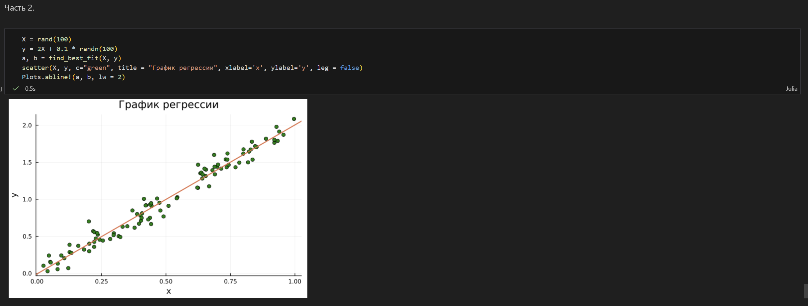{#fig:042 width=70%}

Построим траекторию возможных цен на акции:

- $S$ -- начальная цена акции;
- $T$ -- длина биномиального дерева в годах;
- $n$ -- количество периодов;
- $h = Tn$ -- длина одного периода;
- $\sigma$ -- волатильность акции;
- $r$ -- годовая процентная ставка;
- $u = \mathrm{exp}(rh + \sigma \sqrt{h})$;
- $d = \mathrm{exp}(rh - \sigma \sqrt{h})$;
- $p^* = \dfrac{\mathrm{exp}(rh) -d}{u - d}$;


Пусть $S = 100, \, T = 1, \, n = 10000, \, \sigma = 0.3$ и $r = 0.08$. Попробуем  построить траекторию курса акций(рис. [-@fig:043] - рис. [-@fig:044]). 

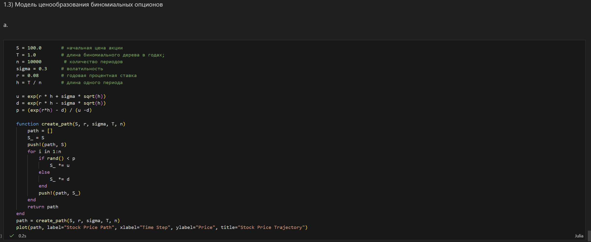{#fig:043 width=70%}

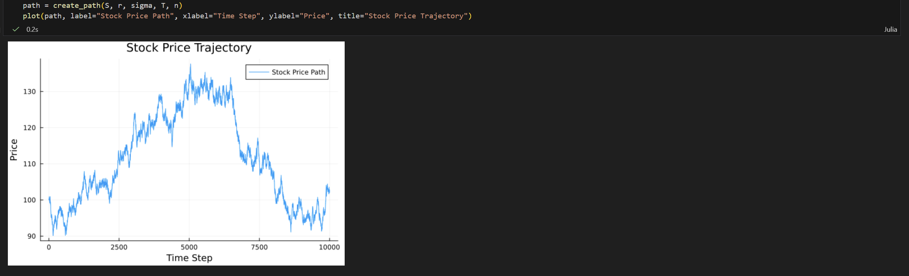{#fig:044 width=70%}

Создадим функцию `createPath (S ::Float64, r ::Float64, sigma ::Float64, T ::Float64, n ::Int64)`, которая создает траекторию цены ак-
ции с учетом начальных параметров. Используем `createPath`, чтобы создать 10
разных траекторий и построим их все на одном графике(рис. [-@fig:045] - рис. [-@fig:046]).

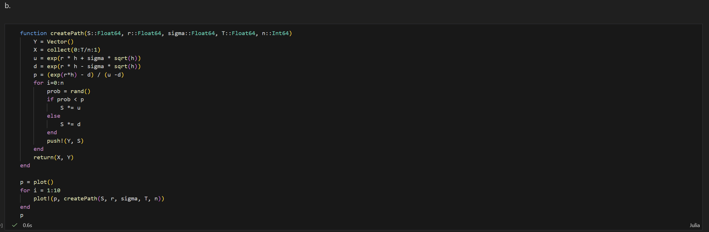{#fig:045 width=70%}

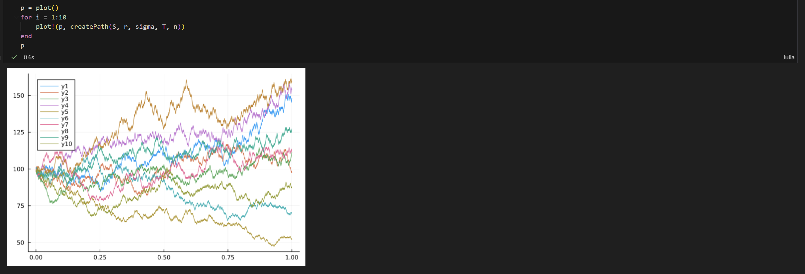{#fig:046 width=70%}

Распараллелим генерацию траектории. Можем использовать `Threads.@threads`,
`pmap` и `@parallel`(рис. [-@fig:047] - рис. [-@fig:048]).

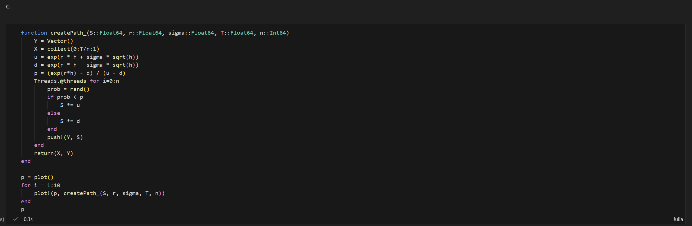{#fig:047 width=70%}

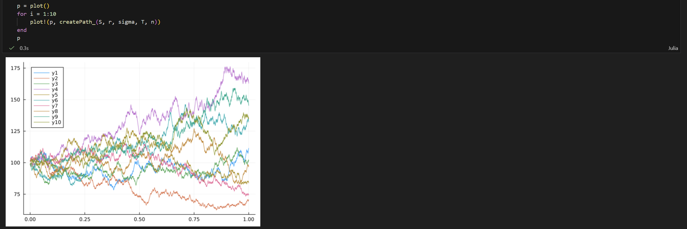{#fig:048 width=70%}

# Вывод

В ходе выполнения лабораторной работы я изучил специализированные пакеты Julia для обработки данных.

# Список литературы{.unnumbered}

::: {#refs}
:::
